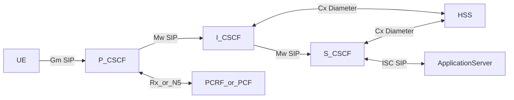
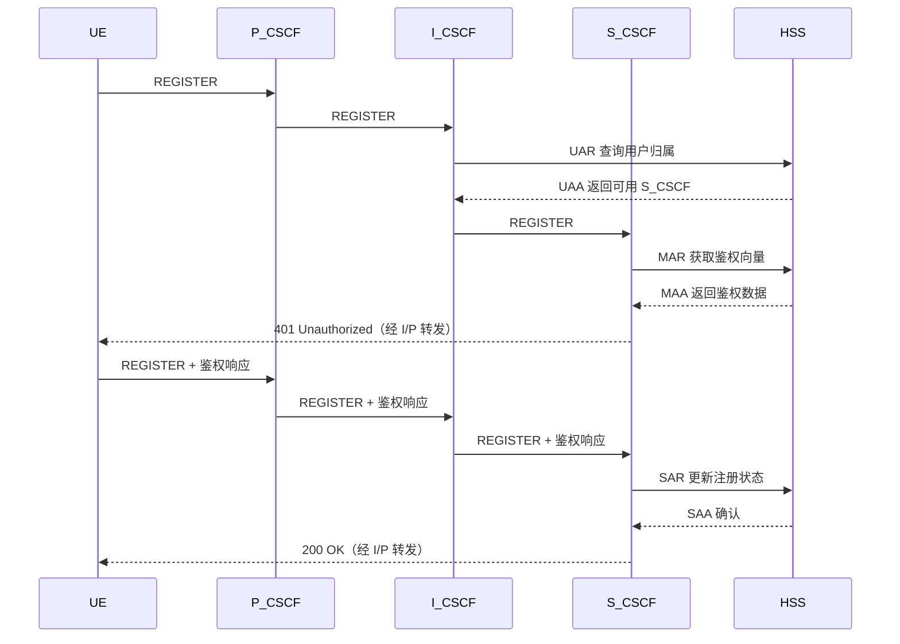

# 三大 CSCF 详解

CSCF（Call Session Control Function）是 IMS 的控制核心，分为 P-CSCF、I-CSCF、S-CSCF。  
可以把它们理解为：入口代理（P）、入口查询与分发（I）、核心业务控制（S）。

## CSCF 与普通 SIP 代理的关系

如果你了解 [SIP 协议基础](/ims/sip-basics)中的 Proxy 和 Registrar 角色，一个自然的问题是：**CSCF 和普通的 Kamailio SIP 代理有什么区别？**

答案是：从 SIP 协议层面看，每个 CSCF 本质上就是一个 Kamailio SIP Proxy。它们都做同样的基础工作——接收 SIP 消息、按路由规则转发、插入 Record-Route/Via 头、管理事务。实际部署中，三个 CSCF 就是三个 Kamailio 进程，各自加载不同的 IMS 专用模块。

区别在于每个 CSCF 在标准 SIP 代理之上叠加了 IMS 规范要求的额外职责：

| 角色 | 作为普通 SIP Proxy 做的事 | IMS 额外叠加的职责 |
|------|--------------------------|-------------------|
| **P-CSCF** | 接收 UE SIP 请求，按规则转发到上游 | IPsec sec-agree 安全关联管理；Diameter Rx 对接 PCRF/PCF 申请 QoS；UE Contact 缓存（IPsec 地址映射）；100rel/PRACK 处理 |
| **I-CSCF** | 接收请求，查找目标后转发 | 通过 Diameter Cx 查询 HSS（UAR/LIR）决定转发给哪个 S-CSCF；拓扑隐藏（对外屏蔽内部 S-CSCF 地址） |
| **S-CSCF** | 维护用户注册（usrloc），按 Contact 路由呼叫 | 通过 Diameter Cx 对接 HSS 完成 AKAv1-MD5 鉴权（替代简单 Digest Auth）；SAR/SAA 注册状态同步；iFC 业务触发（调用 AS） |

换言之：

- **普通 SIP Proxy**（如一个独立的 Kamailio 网关）用内置 `usrloc` 管注册、`tm` 管事务、`rr` 管 Record-Route，鉴权靠本地数据库的 Digest，路由靠配置文件中的静态规则或 DNS。这已经能搭建一套可用的 VoIP 系统。
- **CSCF** 在此基础上，把鉴权委托给 HSS（Diameter）、把策略委托给 PCRF/PCF（Diameter）、把安全委托给 IPsec（内核 xfrm），并按 3GPP 规范拆分成三个各司其职的代理角色，使整套系统适用于运营商级移动网络。

::: tip 类比
如果把普通 Kamailio Proxy 比作一个独立运行的门卫，那 CSCF 就是三个门卫组成的安检链：P-CSCF 查身份证（IPsec），I-CSCF 查花名册找负责人（HSS 查询），S-CSCF 做最终审批和调度（鉴权 + 业务触发）。但每个门卫的"转发消息"这件事本身，和普通 Kamailio Proxy 完全一样。
:::

## 1) P-CSCF：UE 的第一接触点

P-CSCF（Proxy CSCF）是终端进入 IMS 的第一跳，所有 UE SIP 信令都先到 P-CSCF。

### 主要功能

- SIP 信令入口：接收 UE 的 `REGISTER`、`INVITE`、`MESSAGE` 等请求
- 安全关联：与 UE 建立 IPSec/TLS 等安全通道（部署策略相关）
- 消息规范化：头域检查、压缩解压、NAT/路由适配
- 策略联动：与 PCRF/PCF 交互（Rx/N5）为语音请求 QoS 资源
- 上游转发：把请求送往 I-CSCF 或既定路由

### 对外通信

- 向 UE：`Gm`（SIP）
- 向 I-CSCF：`Mw`（SIP）
- 向 PCRF/PCF：`Rx`（Diameter）或 `N5`（HTTP2）

## 2) I-CSCF：入口查询与 S-CSCF 选择

I-CSCF（Interrogating CSCF）是 IMS 域入口控制点，核心职责是“查、选、转”。

### 主要功能

- 域入口：接收来自 P-CSCF 或外部网络的 SIP 请求
- 查询 HSS：通过 `Cx` 查询用户归属和可用 S-CSCF（如 UAR/LIR）
- 选择 S-CSCF：根据 HSS 返回结果路由到目标 S-CSCF
- 拓扑隐藏：隐藏内部 S-CSCF 细节，降低暴露面

### 对外通信

- 向 P-CSCF / 外部 IMS：`Mw`（SIP）
- 向 HSS：`Cx`（Diameter）
- 向 S-CSCF：`Mw`（SIP）

## 3) S-CSCF：IMS 业务控制中枢

S-CSCF（Serving CSCF）是 IMS 注册态和会话态的“大脑”。

### 主要功能

- 注册控制：处理 `REGISTER`，维护用户绑定状态
- 鉴权协同：通过 `Cx` 向 HSS 获取鉴权向量并完成 AKA 流程
- 会话控制：处理 `INVITE` 及后续会话状态机
- 业务触发：依据 iFC 触发应用服务器（AS），如补充业务/短信
- 用户定位：记录用户当前可达位置与接入信息

### 对外通信

- 向 I-CSCF：`Mw`（SIP）
- 向 HSS：`Cx`（Diameter）
- 向 AS：`ISC`（SIP）

## 三者关系总览（谁和谁说话）

## 注册阶段的分工（时序）

## 与 Open5GS 的协同关系

- HSS 侧：Open5GS HSS 可通过 `Cx` 为 I-CSCF/S-CSCF 提供鉴权和用户资料
- 策略侧：Open5GS PCRF（4G）或 PCF（5G）通过 `Rx/N5` 与 P-CSCF 交互
- 承载侧：Open5GS EPC/5GC 在收到策略后创建语音 QoS 承载（QCI1/5QI1）

## 关键理解

- P-CSCF 解决“怎么进 IMS”
- I-CSCF 解决“该去哪个 S-CSCF”
- S-CSCF 解决“用户是否可注册、会话如何控制、业务如何触发”
