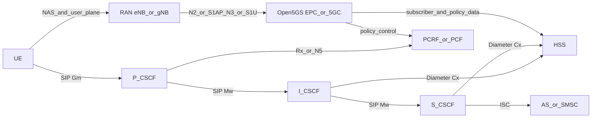

# IMS 系统概述

IMS（IP Multimedia Subsystem）是 3GPP 定义的多媒体业务控制架构，用于在全 IP 网络中提供语音、视频和消息等业务。  
在本实验中，IMS 主要承载 VoLTE/VoNR 的 SIP 信令控制，并与 Open5GS 核心网协同完成注册、鉴权和 QoS 策略下发。

## IMS 在 NR Lab 中的位置

## IMS 核心接口

| 接口 | 连接关系 | 协议 | 用途 |
|------|----------|------|------|
| Gm | UE ↔ P-CSCF | SIP | UE 与 IMS 的信令入口 |
| Mw | P/I/S-CSCF 之间 | SIP | CSCF 内部转发与路由 |
| Cx | I/S-CSCF ↔ HSS | Diameter | 鉴权、用户资料和 S-CSCF 选择 |
| Rx / N5 | P-CSCF ↔ PCRF/PCF | Diameter / HTTP2 | 语音会话 QoS 授权 |
| ISC | S-CSCF ↔ AS | SIP | 增值业务触发（短信、补充业务） |

## 本章节内容

- [SIP 协议基础](/ims/sip-basics) — SIP 协议与 IP 电话基础知识
- [CSCF 三大网元详解](/ims/cscf)
- [IMS 注册与入网流程](/ims/registration)
- [VoLTE/VoNR 集成与部署](/ims/volte)
- [Kamailio 配置入门](/ims/kamailio) — Kamailio 路由配置、伪变量与常用模式
- [Signal6A 网关架构](/ims/signal6a) — WebRTC ↔ VoLTE 桥接系统完整参考
- [手机端 VoLTE 设置](/ims/phone-setup) — 不同机型启用 VoLTE 的具体操作

## 与 Open5GS 的关系

- Open5GS 在 4G 提供 EPC（MME/SGW/PGW/PCRF），在 5G 提供 5GC（AMF/SMF/UPF/PCF）。
- IMS 负责语音业务的 SIP 控制面；Open5GS 负责接入、会话和用户面承载。
- UE 先完成 4G/5G 入网与 IMS APN/PDU 会话，再通过 P-CSCF 发起 IMS 注册。
