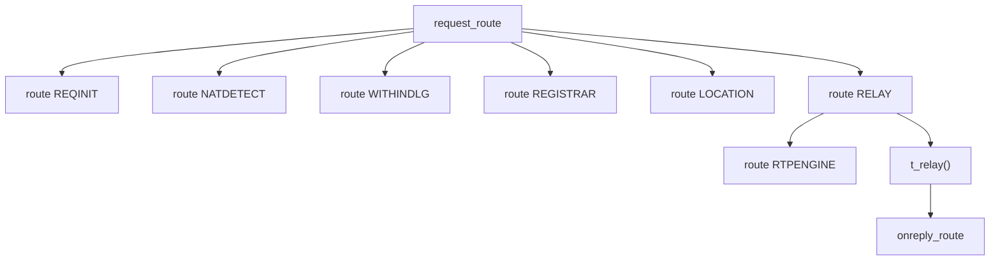
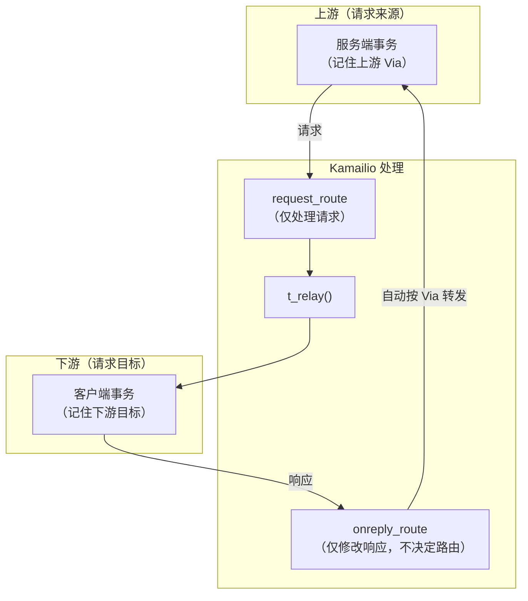

# Kamailio 配置入门

Kamailio 是一个开源 SIP 服务器框架，用 C 编写，通过配置文件（`kamailio.cfg`）定义路由逻辑。在 Signal6A 中，Gateway Kamailio 和三个 CSCF 都是 Kamailio 实例，各自使用不同的配置。

本页介绍 Kamailio 配置的核心概念和常用模式，以 Signal6A 中实际使用的功能为主。阅读本页后再看 [Signal6A 网关架构](/ims/signal6a) 会更容易理解。

## 配置文件结构

一个 Kamailio 配置文件大致分三段：

```
#!define WITH_WEBSOCKET        ← 预处理宏（条件编译）

/* ── 1. 全局参数 ── */
listen=udp:10.0.0.1:5060
listen=tls:10.0.0.1:443
children=8                     ← 工作进程数
log_stderror=no

/* ── 2. 模块加载与参数 ── */
loadmodule "tm.so"
loadmodule "rr.so"
loadmodule "usrloc.so"
modparam("usrloc", "db_mode", 0)       ← 内存模式
modparam("tm", "fr_timer", 30)         ← 无应答超时 30 秒

/* ── 3. 路由逻辑 ── */
request_route {
    ...
}
```

第 3 段是核心——所有 SIP 消息的处理逻辑都写在路由块中。

## 路由块类型

Kamailio 有几种路由块，分别在不同时机触发：

| 路由块 | 触发时机 | Signal6A 中的用途 |
|--------|----------|-------------------|
| `request_route { }` | 每个新 SIP 请求到达时 | 主入口：分类请求，决定转发方向 |
| `route[NAME] { }` | 被主路由或其他路由显式调用 | 子程序：REGISTRAR、LOCATION、RELAY、RTPENGINE 等 |
| `onreply_route[NAME] { }` | 收到 SIP 响应时 | 修改回复（如剥离 PRACK 头、NAT 修复、rtpengine SDP 处理） |
| `failure_route[NAME] { }` | 事务最终失败时（如超时、4xx/5xx） | 故障处理（备选路由、错误日志） |
| `branch_route[NAME] { }` | 每个分支发送前 | 按分支修改目标（较少用到） |

Signal6A 的 Gateway 中，主路由结构大致为：



## 伪变量（Pseudo-Variables）

Kamailio 用 `$xx` 格式的伪变量访问 SIP 消息的各个部分。这是配置中最核心的概念——几乎每条路由规则都在读写伪变量。

### R-URI 相关

R-URI（Request-URI）是 SIP 请求的目标地址，也是路由的核心依据。

| 变量 | 含义 | 示例值 |
|------|------|--------|
| `$ru` | 完整 R-URI | `sip:alice@example.com` |
| `$rU` | R-URI 的 user 部分 | `alice` |
| `$rd` | R-URI 的 domain 部分 | `example.com` |

**改写 R-URI** 是路由的核心操作。Signal6A 中，Gateway 的 LOCATION 路由将本地未找到的号码改写到 IMS 域：

```
$ru = "sip:" + $rU + "@ims.mnc044.mcc460.3gppnetwork.org";
```

### 目标地址 `$du`

`$du`（destination URI）是"出站代理"地址。设置后，Kamailio 将请求发到 `$du` 指定的地址，但 SIP 消息中的 R-URI 保持不变。

```
$du = "sip:127.0.0.21:5062;transport=tcp";
```

这在 IMS 中很常见：R-URI 是被叫号码（逻辑地址），`$du` 是下一跳 CSCF 的物理地址。两者分离让 Proxy 能控制"消息往哪发"而不改变"消息是给谁的"。

### 来源信息

| 变量 | 含义 | 典型用途 |
|------|------|----------|
| `$si` | 消息来源 IP | 环路检测（`$si != gateway.host`） |
| `$sp` | 消息来源端口 | 缓存 UE 地址（`sip:$si:$sp`） |

### SIP 头域

| 变量 | 含义 |
|------|------|
| `$ci` | Call-ID |
| `$cs` | CSeq 序号 |
| `$rm` | 请求方法（INVITE、REGISTER 等） |
| `$fu` | From URI |
| `$fn` | From 显示名 |
| `$tu` | To URI |
| `$td` | To 域 |
| `$hdr(X)` | 读取任意头域 X 的值 |

### Hash Table 变量

`$sht(table=>key)` 访问 `htable` 模块维护的内存哈希表。Signal6A 的 P-CSCF 用它缓存 UE 的 IPsec 地址：

```
$sht(uecontact=>$ci) = "sip:" + $si + ":" + $sp;
```

以 Call-ID 为键存储 UE 的源地址，后续 BYE 到来时可查表找到 UE。

## Flags：消息级开关

Kamailio 提供两类 flag，用作路由决策的布尔标记：

| 类型 | 设置/检查 | 生命周期 | Signal6A 用途 |
|------|-----------|----------|---------------|
| **SIP message flag** | `setflag(N)` / `isflagset(N)` | 当前请求处理期间 | flag 5：NAT 检测到（`NATDETECT` 设置） |
| **Branch flag** | `setbflag(N)` / `isbflagset(N)` | 跨事务持久（保存到 usrloc） | bflag 10：外部通话（`LOCATION` 设置，`RTPENGINE` 检查） |

bflag 10 在 Signal6A 中至关重要：LOCATION 路由将非本地通话标记为 `bflag 10`，RTPENGINE 路由根据此 flag 决定是否做 WebRTC↔SIP 转码。

## 事务、响应与 CANCEL：Kamailio 的处理方式

在 [SIP 协议基础](/ims/sip-basics#sip-事务模型-请求-响应与-cancel-的路由规则)中我们介绍了 SIP 事务模型的三类消息路由规则。这里从 Kamailio 实现的角度，解释这些规则如何体现在配置和运行时行为中。

### 有状态转发 vs 无状态转发

Kamailio 提供两种转发模式：

| 模式 | 函数 | 事务跟踪 | 响应处理 | Signal6A 中的使用 |
|------|------|----------|----------|-------------------|
| **有状态** | `t_relay()` | 创建事务，记住请求和目标 | 自动按 Via 转发响应，触发 `onreply_route` | 所有 CSCF 和 Gateway 的核心转发 |
| **无状态** | `forward()` | 不创建事务 | 不处理响应 | Signal6A 中未使用 |

Signal6A 的所有 Kamailio 实例都使用有状态转发（`t_relay()`）。这意味着：

1. **Kamailio 转发 INVITE 时**：`tm` 模块创建一个服务端事务（server transaction，对接上游）和客户端事务（client transaction，对接下游），记录 Via branch 和目标地址
2. **下游响应到来时**：`tm` 通过 Via branch 匹配到对应的客户端事务，自动将响应转发给上游的服务端事务方向——**这一步完全不经过 `request_route`**
3. **`onreply_route` 是一个钩子**：它让你有机会在响应被自动转发之前修改响应内容（如改写 SDP、剥离头域），但路由方向本身已经确定



### CANCEL 的处理流程

在 `request_route` 中，CANCEL 的处理极其简洁：

```
if (is_method("CANCEL")) {
    if (t_check_trans())
        t_relay();
    exit;
}
```

`t_check_trans()` 在事务表中查找与 CANCEL 匹配的 INVITE 事务（通过 Via branch、Call-ID 等匹配）。找到后，`t_relay()` 将 CANCEL 发往与原 INVITE 相同的目标——**不需要再跑 LOCATION、RELAY 等路由逻辑**。

如果 `t_check_trans()` 返回失败（没有匹配的 INVITE 事务），CANCEL 被丢弃。这种情况通常意味着 INVITE 事务已经结束（已收到最终响应）或 CANCEL 到达得太早（INVITE 还未被处理）。

### `onreply_route` 的实际作用

`onreply_route` 的名字容易产生误导——它不是路由响应的地方，而是**在响应被自动转发前修改响应内容的钩子**。在 Signal6A 中它做三件事：

```
onreply_route {
    // 1. 剥离 VoLTE 的 100rel 头（WebRTC 不支持 PRACK）
    if (status =~ "18[0-9]") {
        remove_hf("Require");
        remove_hf("RSeq");
    }

    // 2. 修复 NAT 相关的 Contact 地址
    fix_nated_contact();

    // 3. 让 rtpengine 处理响应中的 SDP Answer
    if (has_body("application/sdp")) {
        rtpengine_manage();
    }
}
```

注意 `rtpengine_manage()` 在这里无参数调用。rtpengine 通过 Call-ID 和 From-tag 找到之前在请求路由中创建的媒体会话，自动应用反向转换。

### `failure_route`：最终失败后的备选路由

当事务最终失败（收到 4xx/5xx/6xx 或超时），`failure_route` 提供了一个尝试备选路由的机会。例如：

```
failure_route[FAIL] {
    if (t_is_canceled()) exit;  // CANCEL 导致的 487 不需要重试

    if (status == "486") {
        // 被叫忙，可以尝试转到语音信箱
        $ru = "sip:voicemail@example.com";
        t_relay();
    }
}
```

Signal6A 当前未使用 `failure_route`（失败直接返回给主叫），但了解它在调试中有用：如果你看到事务失败后出现了意外的重路由行为，可能是 `failure_route` 在起作用。

### Signal6A CSCF 链中的响应与 CANCEL 处理

把以上概念应用到 Signal6A 的完整 CSCF 链中，看看每个节点在处理响应和 CANCEL 时做了什么：

| 节点 | 对响应的处理（`onreply_route`） | 对 CANCEL 的处理 |
|------|-------------------------------|-----------------|
| **Gateway** | 剥离 100rel 头；NAT Contact 修复；rtpengine SDP Answer 处理 | `t_check_trans()` + `t_relay()` |
| **I-CSCF** | 无特殊处理（响应直接透传） | `t_check_trans()` + `t_relay()` |
| **S-CSCF** | 无特殊处理（响应直接透传） | `t_check_trans()` + `t_relay()` |
| **P-CSCF** | IPsec 相关处理（注册回复中创建 SA、剥离 CK/IK） | `t_check_trans()` + `t_relay()`；需通过 uecontact 缓存找到 UE 的 IPsec 地址 |

#### I-CSCF 和 S-CSCF 的响应路由为什么"透明"

I-CSCF 和 S-CSCF 对通话响应（180/200 等）几乎不做任何处理。这是因为它们使用 `t_relay()` 有状态转发 INVITE，`tm` 模块自动将下游响应转发回上游。整个 CSCF 链对于响应来说只是 Via 逐跳回退的管道。

I-CSCF 甚至不插入 Record-Route（它是无状态的路由分发器），所以通话建立后的对话内请求（BYE、re-INVITE）不经过 I-CSCF——只经过插入了 Record-Route 的 P-CSCF、S-CSCF 和 Gateway。

#### P-CSCF 的 CANCEL/BYE 与 UE Contact 缓存

P-CSCF 处理 CANCEL 和 BYE 时面临一个额外挑战：**这些消息可能来自 IMS 核心方向（不经过 IPsec），但需要送达经 IPsec 保护的 UE。**

对于 CANCEL，`tm` 模块自动将其路由到与 INVITE 相同的目标。如果原 INVITE 经 `ipsec_forward()` 解析了 UE 的 IPsec 地址，CANCEL 会走相同路径。

对于 BYE（对话内请求），情况更复杂——BYE 是按 Route 头路由的新请求，不绑定到 INVITE 事务。P-CSCF 的 `uecontact` 哈希表缓存（以 Call-ID 为键存储 UE 的 IPsec 地址）正是为了解决这个问题：

```
route[WITHINDLG] {
    if (loose_route()) {
        // 检查缓存：是否有该 Call-ID 对应的 UE IPsec 地址
        if ($sht(uecontact=>$ci) != $null) {
            $du = $sht(uecontact=>$ci);  // 设置目标为缓存的 IPsec 地址
        }
        if (is_method("BYE")) {
            $sht(uecontact=>$ci) = $null;  // 通话结束，清除缓存
        }
        route(RELAY);
    }
}
```

::: warning P-CSCF 缓存过期问题
`uecontact` 缓存的 `autoexpire=120`（120 秒过期）。如果通话超过 2 分钟没有对话内请求（如 re-INVITE、UPDATE），缓存可能过期导致 BYE 无法找到 UE 的 IPsec 地址。长时间通话中如果出现挂断失败，这可能是原因之一。
:::

### 有状态 vs 无状态的实际影响

理解有状态转发对排障至关重要：

| 场景 | 使用有状态转发时 | 如果用了无状态转发 |
|------|-----------------|-------------------|
| INVITE 响应回传 | `tm` 自动按 Via 转发所有响应 | 响应丢失——Proxy 不知道如何匹配 |
| CANCEL 转发 | `t_check_trans()` 找到匹配事务 | 找不到事务，CANCEL 失败 |
| 超时处理 | `tm` 按 `fr_timer`/`fr_inv_timer` 生成超时响应 | 无超时机制，请求可能无限等待 |
| 重传去重 | `t_check_trans()` / `t_precheck_trans()` 识别重传 | 每个重传都当作新请求处理 |

这就是为什么 Signal6A 中所有 `request_route` 的开头都有 `t_precheck_trans()` / `t_check_trans()` 检查——确保 UDP 重传不会被当作新请求反复处理。

## 核心函数速查

按功能分组，列出 Signal6A 中常用的 Kamailio 函数：

### 事务管理（tm 模块）

| 函数 | 作用 |
|------|------|
| `t_relay()` | 有状态转发请求到 `$du` 或 R-URI |
| `t_check_trans()` | 检查是否为已知事务的重传 |
| `t_newtran()` | 显式创建新事务（异步 Diameter 回调前需要） |
| `t_on_reply("NAME")` | 注册回复处理路由（如 `REGISTER_REPLY`） |
| `t_on_failure("NAME")` | 注册失败处理路由 |

### Record-Route 与对话路由（rr 模块）

| 函数 | 作用 |
|------|------|
| `record_route()` | 在请求中插入 Record-Route 头（INVITE/SUBSCRIBE 时调用） |
| `loose_route()` | 按 Route 头做松散路由（对话内请求用） |

### 用户注册（usrloc / registrar 模块）

| 函数 | 作用 |
|------|------|
| `save("location")` | 保存 REGISTER 中的 Contact 绑定 |
| `lookup("location")` | 按 R-URI 查找已注册用户，成功则改写 R-URI 为 Contact |

### NAT 处理（nathelper 模块）

| 函数 | 作用 |
|------|------|
| `force_rport()` | 强制响应发回源端口（而非 Via 声明的端口） |
| `nat_uac_test("19")` | 检测 NAT（Via/Contact/SDP 与源 IP 不匹配） |
| `fix_nated_register()` | 将 REGISTER 的 Contact 改写为真实源地址 |
| `fix_nated_contact()` | 将回复中的 Contact 改写为真实源地址 |
| `set_contact_alias()` | 在 Contact URI 中编码真实传输地址 |
| `handle_ruri_alias()` | 从 R-URI 的 alias 参数恢复真实地址 |

### Path 支持（path 模块）

| 函数 | 作用 |
|------|------|
| `add_path_received()` | 在 REGISTER 中添加 Path 头（含实际源地址），WebSocket 用户注册必需 |

### rtpengine 控制（rtpengine 模块）

| 函数 | 作用 |
|------|------|
| `rtpengine_manage(flags)` | 创建或更新 rtpengine 媒体会话，改写 SDP |
| `rtpengine_delete()` | 删除媒体会话（BYE 时调用） |

### 消息检查（sanity 模块）

| 函数 | 作用 |
|------|------|
| `sanity_check("17895", "7")` | 验证 SIP 消息结构完整性 |
| `mf_process_maxfwd_header("10")` | 递减 Max-Forwards，防止路由环路 |

## 常见路由模式

### 模式 1：请求分类管线

几乎所有 Kamailio 配置的 `request_route` 都遵循相同的骨架结构：

```
request_route {
    route(REQINIT);       // 1. 完整性检查
    route(NATDETECT);     // 2. NAT 检测

    if (is_method("CANCEL")) { ... }     // 3. CANCEL 处理
    if (t_check_trans()) exit;           // 4. 重传去重

    if (is_method("INVITE|SUBSCRIBE"))
        record_route();                  // 5. 对话建立请求插入 RR

    route(WITHINDLG);     // 6. 对话内请求处理

    if (is_method("REGISTER")) {
        route(REGISTRAR); exit;          // 7. 注册
    }

    route(LOCATION);      // 8. 查找目标
    route(RELAY);         // 9. 转发
}
```

Signal6A 的四个 Kamailio 实例（Gateway、P-CSCF、I-CSCF、S-CSCF）的 `request_route` 都基于这个骨架，只是步骤 7–9 中的具体逻辑不同。

### 模式 2：对话内路由（WITHINDLG）

```
route[WITHINDLG] {
    if (!has_totag()) return;        // 无 To-tag = 不是对话内请求

    if (loose_route()) {             // Route 头匹配 → 按路由转发
        // ACK、BYE 等特殊处理
        route(RELAY);
    }

    if (is_method("ACK") && t_check_trans())
        route(RELAY);                // 2xx 重传的 ACK

    sl_send_reply(404, "Not Here");
}
```

这个模式在 SIP 基础页的 [Route 头讨论](/ims/sip-basics#record-route-与-route-对话内请求的路径) 中有详细解释。`loose_route()` 检查请求中的 Route 头是否指向自己，是则剥离并按下一条 Route 转发。

### 模式 3：有状态转发（RELAY）

```
route[RELAY] {
    route(RTPENGINE);    // 先处理 SDP（如果有）
    t_on_reply("REPLY"); // 注册回复处理路由
    t_relay();           // 有状态转发
}
```

`t_relay()` 是 Kamailio 的核心转发函数。它将请求发送到 `$du`（若已设置）或 R-URI 指向的地址，并跟踪事务状态以匹配后续的响应。

### 模式 4：条件路由（LOCATION）

```
route[LOCATION] {
    if (lookup("location")) {
        // 用户已注册，R-URI 已被改写为 Contact
        // → 直接 RELAY
    } else {
        // 用户未注册 → 根据配置决定去向
        if (ims_enabled && $rU =~ "^999") {
            $ru = "sip:" + $rU + "@" + ims_domain;
            $du = "sip:" + icscf_host + ":" + icscf_port + ";transport=tcp";
            setbflag(10);
        } else {
            $du = "sip:" + pbx_host + ":" + pbx_port;
            setbflag(10);
        }
    }
    route(RELAY);
}
```

这是典型的"查找-决策-转发"三段式，也是 Signal6A 中 Gateway 和 S-CSCF 的核心路由逻辑。

### 模式 5：回复处理

```
onreply_route[REPLY] {
    if (status =~ "18[0-9]") {
        // 处理 1xx 临时应答（如剥离 100rel 头）
    }
    if (has_body("application/sdp")) {
        rtpengine_manage();  // 处理 SDP Answer
    }
    fix_nated_contact();     // NAT 修复
}
```

回复路由在每个转发的响应到达时触发。Signal6A 的 Gateway 在这里做三件事：剥离 PRACK 相关头域、修复 NAT Contact、让 rtpengine 处理 SDP Answer。

## `$ru` vs `$du`：一个关键区别

初学 Kamailio 时最容易混淆的是 `$ru`（R-URI）和 `$du`（destination URI）的区别：

| | `$ru`（R-URI） | `$du`（destination URI） |
|--|---|---|
| **是什么** | SIP 消息第一行的目标地址 | Kamailio 内部的"出站代理"地址 |
| **对端能看到吗** | 能，是 SIP 消息的一部分 | 不能，纯粹是 Kamailio 内部的转发指令 |
| **默认行为** | `t_relay()` 将请求发到 R-URI | 若 `$du` 已设置，则发到 `$du` 而非 R-URI |
| **典型用法** | 改写被叫号码或域 | 指定下一跳 Proxy 的物理地址 |

在 Signal6A 中，IMS 桥接时两者配合使用：

```
// R-URI 改为 IMS 域的逻辑地址
$ru = "sip:+8613800001234@ims.mnc044.mcc460.3gppnetwork.org";

// 但实际发送到 I-CSCF 的物理地址
$du = "sip:127.0.0.21:5062;transport=tcp";
```

I-CSCF 收到后看到的 R-URI 是 IMS 域号码（用于 HSS 查询），而不是自己的地址。

## 调试建议

Kamailio 配置调试时常用的方法：

- **日志**：在路由中插入 `xlog("L_INFO", "route LOCATION: ru=$ru du=$du method=$rm\n");` 输出变量状态
- **日志级别**：`debug=4`（或更高）可看到模块内部的详细日志
- **SIP 抓包**：配合 Wireshark 或 `sngrep` 对照日志和实际消息
- **kamcmd**：运行时管理工具，如 `kamcmd ul.dump` 查看 usrloc 表、`kamcmd htable.dump uecontact` 查看哈希表

## 继续阅读

- [Signal6A 网关架构](/ims/signal6a) — 以上概念在实际系统中的完整应用
- [CSCF 三大网元](/ims/cscf) — 三个 CSCF 如何用 Kamailio 实现不同角色
- [SIP 协议基础](/ims/sip-basics) — Via、Record-Route、Route 等头域的工作原理
