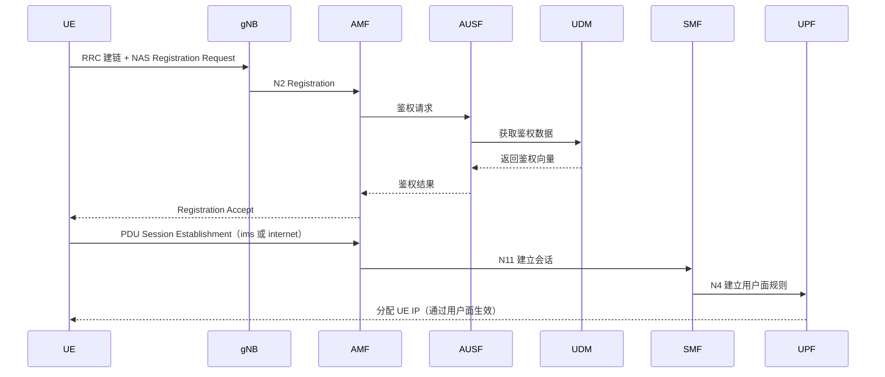
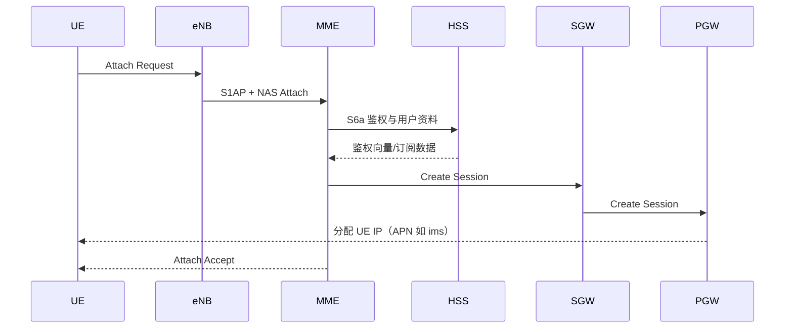
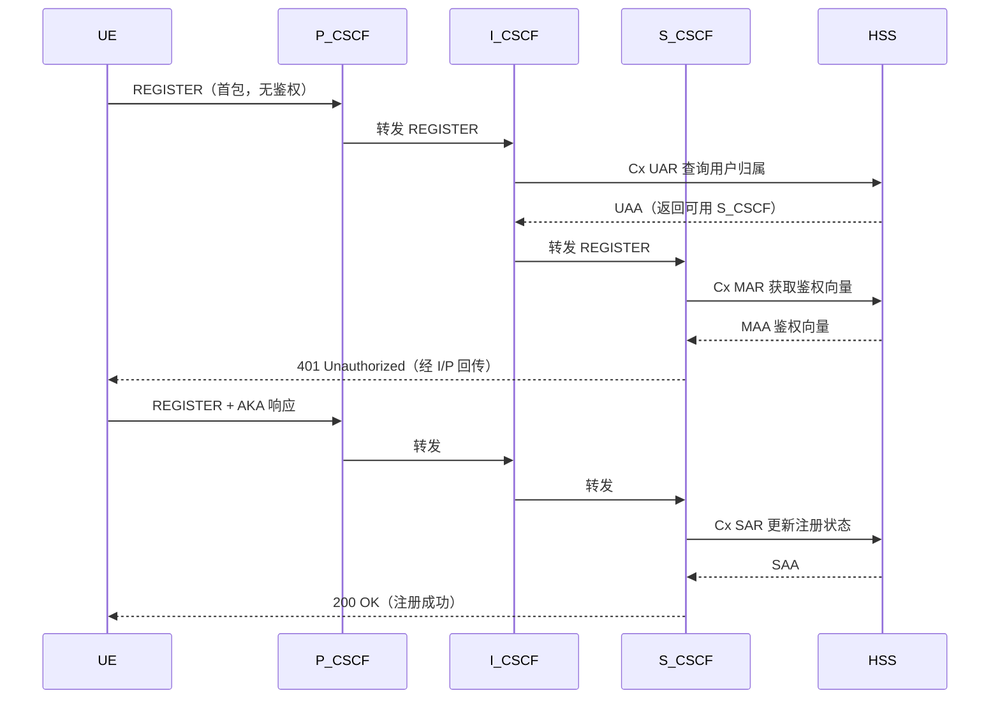
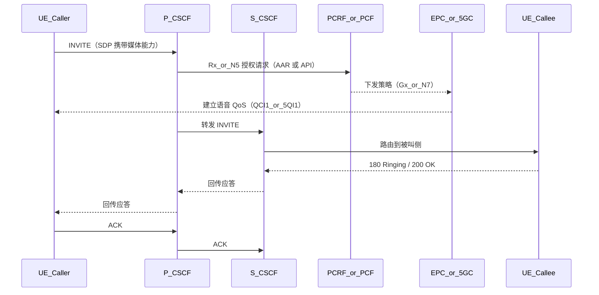

# IMS 注册与入网流程

本页回答两个关键问题：

1. 手机如何先加入 4G/5G 核心网（Open5GS）  
2. 加入核心网后，手机如何完成 IMS 注册并具备语音能力

## 阶段 A：先入网（非 IMS）

IMS 注册前，UE 必须先完成无线接入、鉴权和数据会话建立。

### 5G SA 入网（UE 加入 Open5GS 5GC）

### 4G LTE 入网（UE 加入 Open5GS EPC）

## 阶段 B：发现 P-CSCF

UE 建立 IMS APN/PDU 后，需要知道 P-CSCF 地址，常见来源：

- PCO 下发（核心网在会话建立阶段提供）
- DNS SRV/A 查询（例如 `ims.mncXXX.mccXXX.3gppnetwork.org`）

## 阶段 C：IMS 注册（REGISTER）

## 阶段 D：语音呼叫建立（谁在何时说话）

下面示例是主叫发起 INVITE 后的关键控制流程：

## 4G 与 5G 的关键差异

| 维度 | 4G VoLTE | 5G VoNR |
|------|----------|----------|
| 接入核心 | EPC（MME/SGW/PGW） | 5GC（AMF/SMF/UPF） |
| 策略控制 | PCRF（Rx + Gx） | PCF（N5/Rx + N7） |
| 语音承载 | Dedicated Bearer（QCI1） | QoS Flow（5QI1） |
| IMS 控制 | P/I/S-CSCF（相同） | P/I/S-CSCF（相同） |

## 一句话总结

- UE 先“入网拿 IP”，再“注册 IMS”
- CSCF 负责 SIP 控制，Open5GS 负责接入/会话/承载
- 策略网元（PCRF/PCF）把语音会话映射成可保障的 QoS 资源
