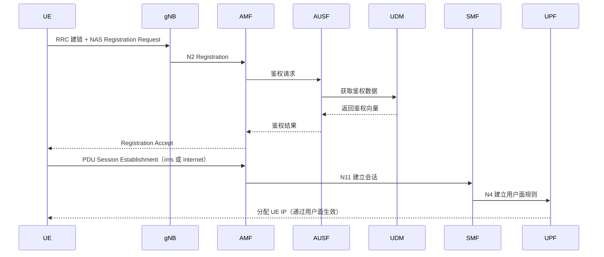
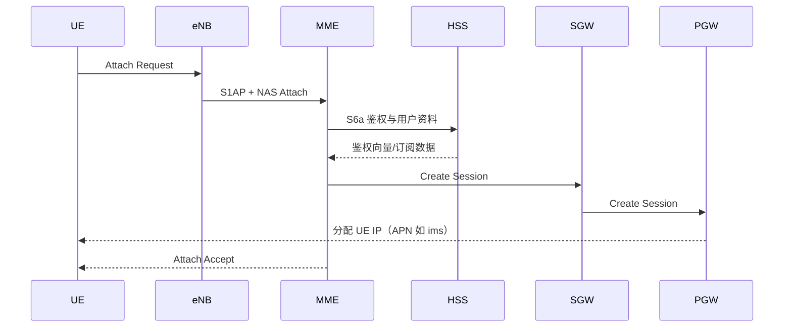
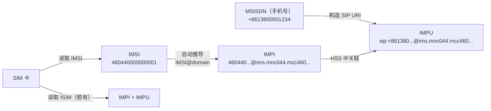
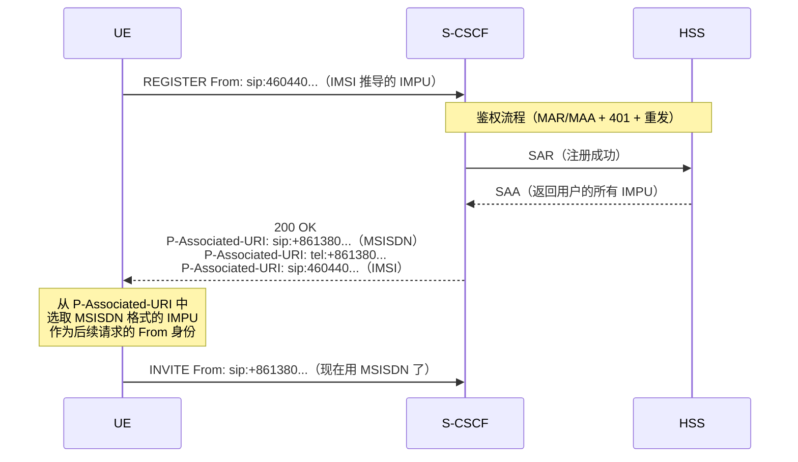
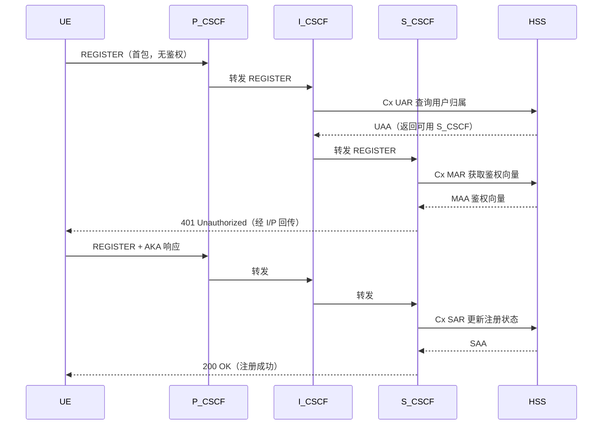
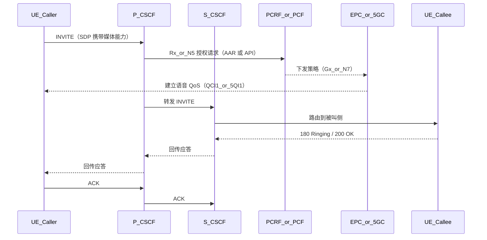

# IMS 注册与入网流程

本页回答两个关键问题：

1. 手机如何先加入 4G/5G 核心网（Open5GS）  
2. 加入核心网后，手机如何完成 IMS 注册并具备语音能力

## 阶段 A：先入网（非 IMS）

IMS 注册前，UE 必须先完成无线接入、鉴权和数据会话建立。

### 5G SA 入网（UE 加入 Open5GS 5GC）



### 4G LTE 入网（UE 加入 Open5GS EPC）



## 阶段 B：发现 P-CSCF

UE 建立 IMS APN/PDU 后，需要知道 P-CSCF 地址，常见来源：

- PCO 下发（核心网在会话建立阶段提供）
- DNS SRV/A 查询（例如 `ims.mncXXX.mccXXX.3gppnetwork.org`）

## IMS 身份体系：从 SIM 卡到电话号码

在进入注册流程之前，先理解 IMS 中的身份转换关系。这是很多人读 IMS 信令时的困惑点——SIM 卡里的 IMSI、手机号、SIP 注册用的 URI，这些东西之间是什么关系？

### 四个身份

| 身份 | 全称 | 示例 | 存储在哪 |
|------|------|------|----------|
| **IMSI** | International Mobile Subscriber Identity | `460440000000001` | SIM 卡 (USIM) |
| **MSISDN** | Mobile Subscriber ISDN Number（即手机号） | `+8613800001234` | HSS 订阅数据 |
| **IMPI** | IMS Private Identity（鉴权用） | `460440000000001@ims.mnc044.mcc460.3gppnetwork.org` | SIM 卡 (ISIM) 或从 IMSI 推导 |
| **IMPU** | IMS Public User Identity（对外可见的 SIP 地址） | `sip:+8613800001234@ims.mnc044.mcc460.3gppnetwork.org` | SIM 卡 (ISIM) 或 HSS 配置 |

### 转换关系



- **IMSI → IMPI**：如果 SIM 卡没有 ISIM 应用（很多实验卡如 sysmoISIM 有 ISIM），UE 会从 IMSI 推导 IMPI，格式通常是 `<IMSI>@ims.mnc<MNC>.mcc<MCC>.3gppnetwork.org`
- **MSISDN → IMPU**：IMPU 通常是手机号构成的 SIP URI，如 `sip:+8613800001234@ims.mnc044.mcc460.3gppnetwork.org`
- **IMPI ↔ IMPU 关联**：在 HSS 中配置，一个 IMPI 可以关联多个 IMPU（如一个号码 + 一个 tel: URI）

### 两种注册场景：SIM 卡有无 MSISDN

UE 注册时 From/To 中放的 IMPU 取决于 SIM 卡上有什么信息。这产生了两种常见场景：

#### 场景 A：SIM 卡上有 ISIM 或 MSISDN

UE 直接用 MSISDN 构造 IMPU 发起注册：

```
REGISTER sip:ims.mnc044.mcc460.3gppnetwork.org SIP/2.0
From: <sip:+8613800001234@ims.mnc044.mcc460...>    ← IMPU（从 MSISDN 构造）
To: <sip:+8613800001234@ims.mnc044.mcc460...>      ← IMPU
Authorization: Digest username="460440000000001@ims.mnc044.mcc460..."  ← IMPI
```

#### 场景 B：SIM 卡上无 MSISDN（实验中常见）

很多实验用 SIM 卡（如 sysmoISIM）没有写入 MSISDN，或者 ISIM 参数不完整。这时 UE 会用 IMSI 推导出的身份注册：

```
REGISTER sip:ims.mnc044.mcc460.3gppnetwork.org SIP/2.0
From: <sip:460440000000001@ims.mnc044.mcc460...>   ← IMPU（从 IMSI 推导）
To: <sip:460440000000001@ims.mnc044.mcc460...>     ← IMPU
Authorization: Digest username="460440000000001@ims.mnc044.mcc460..."  ← IMPI
```

注意这里 From/To 中的 IMPU 不是手机号，而是 IMSI。这完全合法——UE 用它能有的身份注册，HSS 只要能通过 IMPI 找到对应的订阅数据就行。

### P-Associated-URI：HSS 告诉 UE "你的号码是什么"

那么问题来了：如果 UE 用 IMSI 注册的，它怎么知道自己的电话号码？

答案是 **P-Associated-URI** 头。注册成功的 `200 OK` 中，S-CSCF 会返回该用户在 HSS 中关联的**所有 IMPU**：

```
SIP/2.0 200 OK
P-Associated-URI: <sip:+8613800001234@ims.mnc044.mcc460.3gppnetwork.org>
P-Associated-URI: <tel:+8613800001234>
P-Associated-URI: <sip:460440000000001@ims.mnc044.mcc460.3gppnetwork.org>
```

这里你会看到三个 URI：
- `sip:+8613800001234@...` — 基于 MSISDN 的 IMPU（这就是"电话号码"对应的 SIP 身份）
- `tel:+8613800001234` — 同一号码的 tel: URI 形式
- `sip:460440000000001@...` — 基于 IMSI 的 IMPU（UE 注册时用的那个）

**P-Associated-URI 就是 UE 获取自己电话号码的权威来源。** UE 收到后：

1. 从中选取一个 IMPU 作为后续请求的"首选公开身份"（通常选 MSISDN 格式的）
2. 后续发 INVITE 时，From 头使用这个 MSISDN 格式的 IMPU，而不是 IMSI
3. 手机的拨号界面也据此显示"本机号码"



### 在通话路由中的使用

通话时，身份的使用方式不同：

| 场景 | 使用的身份 | 在 SIP 中的位置 | 用途 |
|------|-----------|----------------|------|
| 主叫发起 INVITE | 主叫的 IMPU（MSISDN 格式） | From 头 | 标识主叫方（来自 P-Associated-URI） |
| 被叫号码 | 被叫的 MSISDN/IMPU | R-URI + To 头 | S-CSCF 用 IMPU 在 usrloc 中查找被叫的注册 Contact |
| S-CSCF 路由查找 | 被叫的 IMPU | `lookup("location")` 的键 | 找到被叫 UE 注册时留下的 Contact（含 P-CSCF 地址） |
| 跨域呼叫（WebRTC → IMS） | 被叫号码 | R-URI 改写为 `sip:<号码>@<ims-domain>` | Gateway 将号码转为 IMS 域的 IMPU 格式 |

::: warning S-CSCF 的 IMPU 匹配
S-CSCF 的 `lookup("location")` 需要用 IMPU 查找注册记录。如果 UE 用 IMSI 格式的 IMPU 注册，而来电的 R-URI 是 MSISDN 格式的 IMPU，S-CSCF 需要能关联这两者。这依赖 HSS 的 SAA 返回的 IMPU 列表——S-CSCF 在保存注册时会将所有关联的 IMPU 都绑定到同一个 Contact，这样无论来电用哪个 IMPU 作为 R-URI 都能找到。
:::

::: tip 在实验中的配置
在 Open5GS 的 subscriber 数据中，你需要同时配置 IMSI 和 MSISDN。即使 SIM 卡上没有写入 MSISDN，只要 HSS 中正确配置了 IMSI 与 MSISDN 的关联，注册 200 OK 的 P-Associated-URI 就会带回 MSISDN 格式的 IMPU，UE 即可正常获取电话号码。如果使用 sysmoISIM，可以通过 `pySim` 工具写入 ISIM 参数（IMPI/IMPU），但即使不写入，靠 HSS 侧配置 + P-Associated-URI 机制同样可以工作。
:::

## 阶段 C：IMS 注册（REGISTER）



## 阶段 D：语音呼叫建立（谁在何时说话）

下面示例是主叫发起 INVITE 后的关键控制流程：



## 4G 与 5G 的关键差异

| 维度 | 4G VoLTE | 5G VoNR |
|------|----------|----------|
| 接入核心 | EPC（MME/SGW/PGW） | 5GC（AMF/SMF/UPF） |
| 策略控制 | PCRF（Rx + Gx） | PCF（N5/Rx + N7） |
| 语音承载 | Dedicated Bearer（QCI1） | QoS Flow（5QI1） |
| IMS 控制 | P/I/S-CSCF（相同） | P/I/S-CSCF（相同） |

## 一句话总结

- UE 先“入网拿 IP”，再“注册 IMS”
- CSCF 负责 SIP 控制，Open5GS 负责接入/会话/承载
- 策略网元（PCRF/PCF）把语音会话映射成可保障的 QoS 资源
