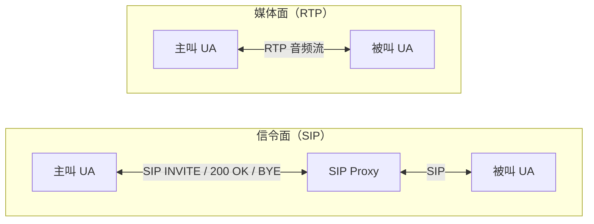
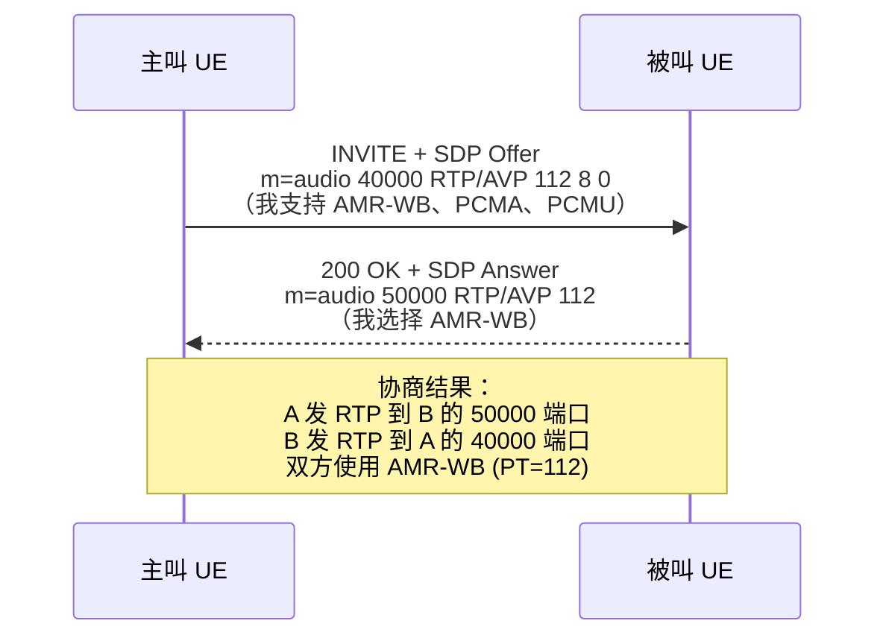
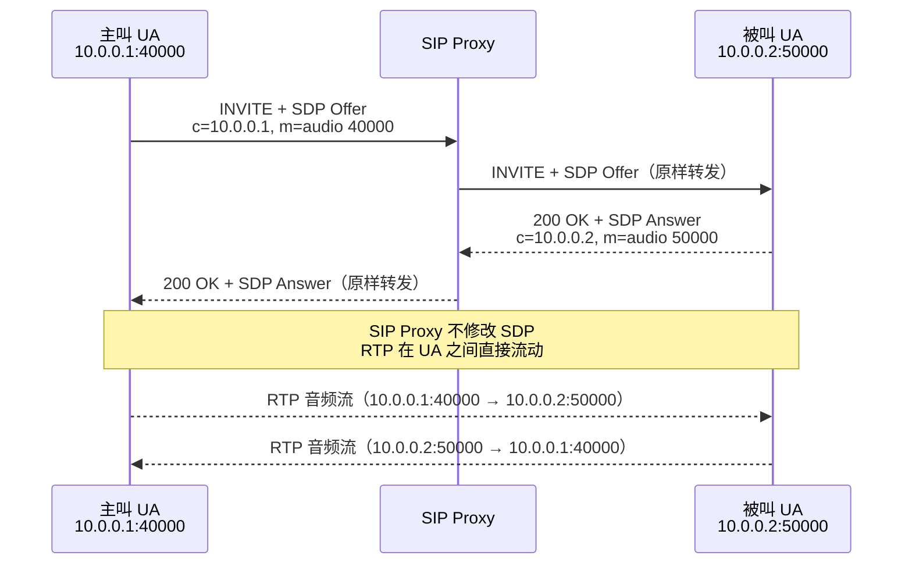
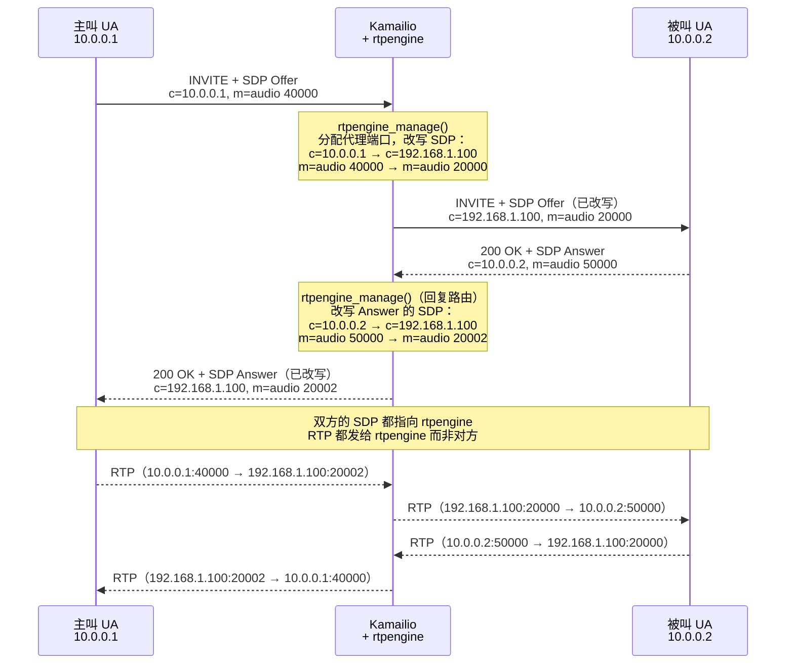
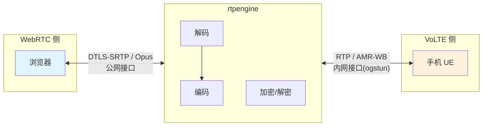
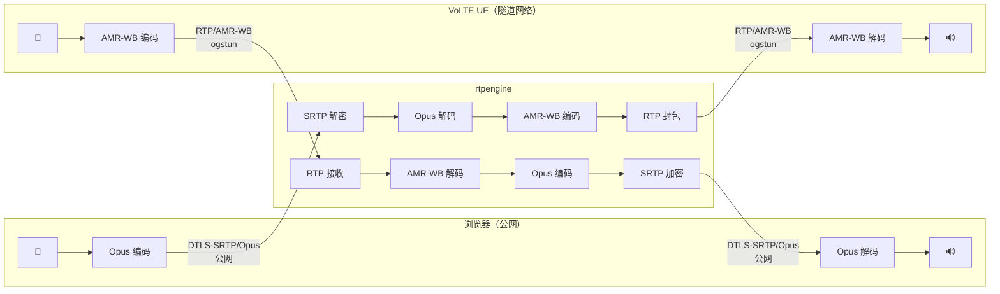

# RTP 与实时音频传输

在 [SIP 协议基础](/ims/sip-basics) 中我们提到，SIP 只负责"怎么建立/结束会话"，不直接承载语音流——语音走的是 RTP。本页详细介绍 RTP 的工作原理、常见音频编解码、以及 rtpengine 作为媒体代理如何改变通话的媒体路径。

## 信令面与媒体面的分离

IP 电话系统的一个核心设计是**信令面和媒体面完全分离**：



- **信令面**经过 SIP Proxy 链路（在 IMS 中是 P-CSCF → I-CSCF → S-CSCF），负责协商、建立和拆除会话
- **媒体面**默认在两个终端之间直接传输，不经过 Proxy

这意味着 SIP Proxy 只处理文本格式的 SIP 消息（几百字节），不需要处理高带宽的音频数据流。这也是为什么排障时经常遇到"信令通了但没声音"——两个面是独立的，信令成功不代表媒体路径也通了。

## RTP 基础

### 什么是 RTP

RTP（Real-time Transport Protocol，RFC 3550）是互联网上传输实时媒体的标准协议。它运行在 UDP 之上，提供：

- **时间戳**：接收方据此恢复音频的播放节奏
- **序列号**：检测丢包和乱序
- **负载类型标识**：告知接收方数据用的什么编解码
- **SSRC**：标识媒体源，区分不同发送者

RTP 选择 UDP 而非 TCP，是因为实时音频对**延迟敏感但对丢包容忍**。TCP 的重传机制会引入不可预测的延迟——对语音来说，丢一个 20ms 的包远不如等 200ms 重传来得糟糕。

### RTP 包结构

```
 0                   1                   2                   3
 0 1 2 3 4 5 6 7 8 9 0 1 2 3 4 5 6 7 8 9 0 1 2 3 4 5 6 7 8 9 0 1
+-+-+-+-+-+-+-+-+-+-+-+-+-+-+-+-+-+-+-+-+-+-+-+-+-+-+-+-+-+-+-+-+
|V=2|P|X|  CC   |M|     PT      |       Sequence Number         |
+-+-+-+-+-+-+-+-+-+-+-+-+-+-+-+-+-+-+-+-+-+-+-+-+-+-+-+-+-+-+-+-+
|                           Timestamp                           |
+-+-+-+-+-+-+-+-+-+-+-+-+-+-+-+-+-+-+-+-+-+-+-+-+-+-+-+-+-+-+-+-+
|                             SSRC                              |
+-+-+-+-+-+-+-+-+-+-+-+-+-+-+-+-+-+-+-+-+-+-+-+-+-+-+-+-+-+-+-+-+
|                          Payload ...                          |
+-+-+-+-+-+-+-+-+-+-+-+-+-+-+-+-+-+-+-+-+-+-+-+-+-+-+-+-+-+-+-+-+
```

| 字段 | 含义 |
|------|------|
| **V** (2 bit) | 版本号，固定为 2 |
| **PT** (7 bit) | Payload Type，标识编解码类型（如 0=PCMU, 8=PCMA, 动态分配的 96+ 用于 AMR/Opus 等） |
| **Sequence Number** (16 bit) | 每发一个包递增 1，接收方用来检测丢包和乱序 |
| **Timestamp** (32 bit) | 采样时钟的时间戳，不是墙上时钟。以采样率为单位递增（如 8kHz 的 G.711 每 20ms 包递增 160） |
| **SSRC** (32 bit) | 同步源标识符，随机生成，标识一路媒体流 |
| **Payload** | 实际的编码音频数据 |

### 一次通话中 RTP 的运作

以一个 20ms 打包间隔的 G.711 通话为例：

1. 麦克风每 20ms 采集 160 个样本（8000 Hz × 0.02s）
2. 编码器将样本编码为 G.711 负载（160 字节）
3. 封装为 RTP 包：12 字节 RTP 头 + 160 字节负载 = 172 字节
4. 加上 UDP 头（8 字节）+ IP 头（20 字节）= 总共约 200 字节
5. 每秒发送 50 个这样的包（1000ms ÷ 20ms），单向约 80 kbps

接收端的处理：

1. 收到 RTP 包后放入 **jitter buffer**（抖动缓冲区）
2. jitter buffer 按 Sequence Number 排序，吸收网络延迟抖动
3. 按 Timestamp 间隔从 buffer 中取出数据送给解码器
4. 解码器还原为 PCM 样本，送给扬声器播放


### Jitter Buffer 的作用

网络传输的延迟不是恒定的——包 A 可能 30ms 到达，包 B 可能 50ms，包 C 可能 20ms。如果收到就立刻播放，听到的语音会忽快忽慢。jitter buffer 引入一个小的固定延迟（通常 20–60ms），把这些不规则到达的包"对齐"到均匀的播放节奏。

代价是增加了端到端延迟。语音通话的可接受延迟通常在 150ms 以内（单向），超过 300ms 对话会明显不自然。

## RTCP：RTP 的控制搭档

RTCP（RTP Control Protocol）与 RTP 配套，传输媒体质量统计信息。RTCP 包含：

| 报告类型 | 发送方 | 内容 |
|----------|--------|------|
| **SR**（Sender Report） | 发送端 | 已发送的包数、字节数、NTP 时间戳 |
| **RR**（Receiver Report） | 接收端 | 丢包率、累计丢包数、jitter 统计、往返延迟 |

RTCP 传统上使用 RTP 端口 +1 的端口（如 RTP 用 10000，RTCP 用 10001）。现代协议（尤其 WebRTC）使用 **rtcp-mux**，把 RTCP 和 RTP 复用到同一端口。

::: tip 在 Wireshark 中观察
抓包时你会看到 RTCP 包穿插在 RTP 流中。SR/RR 报告可以告诉你实时的丢包率和 jitter——这是诊断通话质量问题的重要数据源。
:::

## 音频编解码

不同的场景使用不同的音频编解码器。编解码器决定了音质、带宽消耗和计算复杂度：

| 编解码 | 采样率 | 比特率 | 带宽 | 典型场景 |
|--------|--------|--------|------|----------|
| **G.711 μ-law (PCMU)** | 8 kHz | 64 kbps | 窄带 | 传统 PSTN/PBX，PT=0 |
| **G.711 A-law (PCMA)** | 8 kHz | 64 kbps | 窄带 | 欧洲 PSTN，PT=8 |
| **AMR-NB** | 8 kHz | 4.75–12.2 kbps | 窄带 | 2G/3G 语音，VoLTE 备选 |
| **AMR-WB** | 16 kHz | 6.6–23.85 kbps | 宽带 | **VoLTE/VoNR 首选**（"HD Voice"） |
| **Opus** | 48 kHz | 6–510 kbps | 全带宽 | **WebRTC 强制**，自适应带宽 |

### AMR-WB：VoLTE 的默认编解码

AMR-WB（Adaptive Multi-Rate Wideband）是 3GPP 为移动语音定义的编解码。"Wideband"指 16kHz 采样率，比传统电话的 8kHz 多了一倍频率范围，通话听起来更清晰自然——这就是运营商宣传的"高清语音"。

AMR-WB 的"Adaptive"体现在它有 9 个码率档位（6.6–23.85 kbps），可根据网络状况动态调整。无线信道质量下降时降低码率以减少丢包影响，信道好时提升码率改善音质。

### Opus：WebRTC 的选择

Opus 是 WebRTC 规范强制要求的编解码。它覆盖从低带宽语音到高质量音乐的整个范围，支持 6kbps 到 510kbps 的比特率，能动态切换窄带和全带宽模式。

### 为什么需要转码

VoLTE UE 说的是 AMR-WB，WebRTC 浏览器说的是 Opus——它们听不懂对方的语言。当两种不同编解码的终端通话时，中间必须有人做翻译，这就是**转码**（transcoding）。在 Signal6A 中，rtpengine 承担这个角色。

## SDP 如何决定 RTP 参数

在 [SIP 协议基础](/ims/sip-basics#sdp-与媒体协商-offer-answer) 中我们简单提到了 SDP。这里展开说明 SDP 中的关键字段如何决定 RTP 通信的具体参数。

### 一个典型的 SDP

```
v=0
o=- 12345 12345 IN IP4 10.45.0.100
s=-
c=IN IP4 10.45.0.100
t=0 0
m=audio 40000 RTP/AVP 112 8 0
a=rtpmap:112 AMR-WB/16000/1
a=fmtp:112 mode-change-capability=2; max-red=0
a=rtpmap:8 PCMA/8000
a=rtpmap:0 PCMU/8000
a=ptime:20
a=sendrecv
```

| SDP 字段 | 含义 | 对 RTP 的影响 |
|----------|------|---------------|
| `c=IN IP4 10.45.0.100` | 媒体目标 IP | RTP 包发往此地址 |
| `m=audio 40000 RTP/AVP 112 8 0` | 媒体类型、端口、传输协议、支持的编解码列表 | RTP 包发往端口 40000，优先使用 PT=112 |
| `a=rtpmap:112 AMR-WB/16000/1` | PT 112 对应 AMR-WB，16kHz，1 通道 | 接收方按此解码 PT=112 的 RTP 负载 |
| `a=ptime:20` | 打包间隔 20ms | 每 20ms 发一个 RTP 包 |
| `a=sendrecv` | 双向收发 | 双方都发送和接收 RTP |

### Offer/Answer 协商

SIP INVITE 的 Offer/Answer 模型决定了最终的 RTP 参数：



Offer 列出发送方支持的所有编解码（按优先级排列），Answer 从中选择双方都支持的编解码子集。最终双方使用 Answer 中列出的编解码通信。

### RTP/AVP vs UDP/TLS/RTP/SAVPF

SDP 的 `m=` 行中的传输协议字段反映了不同的安全级别：

| 协议 | 含义 | 使用场景 |
|------|------|----------|
| `RTP/AVP` | 明文 RTP | 传统 SIP、VoLTE（安全由 IPsec 在网络层保障） |
| `RTP/SAVP` | SRTP（加密 RTP） | 安全 SIP |
| `UDP/TLS/RTP/SAVPF` | DTLS-SRTP + RTCP 反馈 | **WebRTC 强制** |

这个差异正是 rtpengine 需要介入的原因之一——VoLTE 使用 `RTP/AVP`（明文），WebRTC 使用 `UDP/TLS/RTP/SAVPF`（DTLS-SRTP 加密），两者无法直接互通。

## 无 rtpengine 的正常通话流程

先看不使用 rtpengine 时，一通标准 SIP 通话的媒体路径：



SIP Proxy 只转发信令，完全不接触媒体流。RTP 在两个 UA 之间直接传输。这是最简单、延迟最低的模式。

但这种模式有几个实际问题：

1. **NAT 穿越**：如果 UA 在 NAT 后面，SDP 中的 IP/端口是内网地址，对方发 RTP 过来根本到不了
2. **编解码不兼容**：如果两个 UA 没有共同支持的编解码，通话无法建立
3. **协议不兼容**：一边是 RTP/AVP（VoLTE），另一边是 DTLS-SRTP（WebRTC），加密方式完全不同
4. **网络隔离**：两个 UA 可能在不同的网络中（如公网 vs 运营商隧道），IP 层不可达
5. **运维盲区**：Proxy 完全看不到媒体质量，无法监控和计费

## rtpengine：媒体面代理

rtpengine 就是为解决上述问题而存在的。它是一个用户态 RTP 代理，由 Sipwise 开发，内核旁路（也支持内核模块加速），通过 SIP Proxy（如 Kamailio）的控制，介入媒体路径。

### rtpengine 的核心能力

| 能力 | 作用 |
|------|------|
| **媒体锚定** | 所有 RTP 流量都经过 rtpengine，解决 NAT 穿越和网络隔离问题 |
| **SDP 改写** | 修改 SDP 中的 IP 和端口，让双方都向 rtpengine 发送 RTP |
| **编解码转码** | 在不同编解码之间实时转换（如 Opus ↔ AMR-WB） |
| **加密桥接** | 在 DTLS-SRTP（WebRTC）和明文 RTP 之间转换 |
| **ICE 处理** | 为 WebRTC 端生成/消费 ICE candidates |
| **多接口绑定** | 不同通话腿绑定到不同网络接口（公网 vs 内网） |

### rtpengine 如何改变通话流程

引入 rtpengine 后，Kamailio 在转发 INVITE 时调用 `rtpengine_manage()` 改写 SDP：



关键变化：
- **主叫看到的 SDP Answer** 中的 IP 和端口不再是被叫的真实地址，而是 rtpengine 的地址
- **被叫看到的 SDP Offer** 同理，IP 和端口被替换为 rtpengine 的地址
- **双方都认为自己在和 rtpengine 通话**，rtpengine 在中间做透明中继

::: tip UA 无感知
从 UA 的角度看，它只是按 SDP 中告知的地址发送和接收 RTP。它并不知道自己是在和对方直接通话还是通过了代理。整个代理过程对 UA 完全透明。
:::

### Kamailio 与 rtpengine 的交互

Kamailio 通过 UDP 控制协议与 rtpengine 通信（默认 `127.0.0.1:22222`）。Kamailio 的 `rtpengine` 模块提供两个核心函数：

| 函数 | 调用时机 | 作用 |
|------|----------|------|
| `rtpengine_manage(flags)` | INVITE/UPDATE 请求和携带 SDP 的回复 | 创建或更新媒体会话，按 flags 改写 SDP |
| `rtpengine_delete()` | BYE | 拆除媒体会话，释放端口 |

rtpengine 通过 SIP 消息的 **Call-ID** 和 **From-tag** 关联同一通话的 Offer 和 Answer。Kamailio 在请求路由中处理 Offer（`rtpengine_manage(flags)`），在回复路由中处理 Answer（`rtpengine_manage()` 无参数，自动应用反向转换）。

## rtpengine 在 Signal6A 中的角色

Signal6A 的场景更复杂——不仅需要媒体锚定，还需要跨越两个完全不同的媒体世界：



rtpengine 在 Signal6A 中同时解决三个问题：

### 1. 加密桥接

WebRTC 规范强制要求 DTLS-SRTP 加密——浏览器不会发送也不会接收明文 RTP。VoLTE 的 RTP 是明文的（安全性由 IPsec 在网络层保障）。rtpengine 在两者之间做加密/解密转换：

- **WebRTC → VoLTE**：终结 DTLS 握手，解密 SRTP 为明文 RTP
- **VoLTE → WebRTC**：将明文 RTP 加密为 SRTP，维护 DTLS 会话

### 2. 编解码转码

浏览器发送 Opus (48kHz)，VoLTE UE 期望 AMR-WB (16kHz)。rtpengine 实时将 Opus 解码为 PCM，再编码为 AMR-WB（反向同理）。这个过程每 20ms 执行一次，延迟约 1-2ms。

### 3. 多接口媒体锚定

Signal6A 部署中，WebRTC 客户端在公网，VoLTE UE 在运营商隧道网络（ogstun 接口）。两者 IP 层不直接可达。rtpengine 配置两个网络接口：

```nix
services.rtpengine.interfaces = {
  external = "203.0.113.50";   # 公网 IP，WebRTC 客户端可达
  internal = "10.45.0.1";      # ogstun 接口，VoLTE UE 可达
};
```

Kamailio 通过 `direction=` 参数告诉 rtpengine 每条通话腿该绑定到哪个接口。

### SDP 转换示例

当 WebRTC 用户呼叫 VoLTE UE 时，Gateway Kamailio 的 RTPENGINE 路由执行以下 SDP 转换：

**浏览器原始 SDP Offer（WebRTC 格式）：**

```
m=audio 9 UDP/TLS/RTP/SAVPF 111
c=IN IP4 0.0.0.0
a=rtpmap:111 opus/48000/2
a=ice-ufrag:abcd
a=ice-pwd:xxxxxxxxxxxx
a=fingerprint:sha-256 AA:BB:CC:...
a=setup:actpass
a=rtcp-mux
a=candidate:1 1 udp 2130706431 203.0.113.80 54321 typ host
```

**rtpengine 改写后发给 VoLTE 的 SDP Offer（SIP 格式）：**

```
m=audio 30010 RTP/AVP 112 118 8 0
c=IN IP4 10.45.0.1
a=rtpmap:112 AMR-WB/16000/1
a=rtpmap:118 AMR/8000/1
a=rtpmap:8 PCMA/8000
a=rtpmap:0 PCMU/8000
a=ptime:20
a=sendrecv
```

变化总结：

| 原始（WebRTC） | 改写后（VoLTE） | 原因 |
|---------------|----------------|------|
| `UDP/TLS/RTP/SAVPF` | `RTP/AVP` | 剥离 DTLS-SRTP |
| Opus (PT=111) | AMR-WB/AMR/PCMA/PCMU | 转码替换编解码列表 |
| ICE candidates | 移除 | VoLTE 不使用 ICE |
| `a=fingerprint`, `a=setup` | 移除 | DTLS 相关属性 |
| `a=rtcp-mux` | 移除（RTCP 拆分到独立端口） | VoLTE 使用传统 RTCP |
| `c=0.0.0.0`（ICE 占位） | `c=10.45.0.1`（rtpengine 内网接口） | 媒体锚定到 ogstun |

### 完整的媒体路径

一通 WebRTC → VoLTE 通话建立后，数据流向如下：



每个语音包都经历：编码 → 加密（可选）→ 网络传输 → 解密（可选）→ 解码 → 重编码 → 加密（可选）→ 网络传输。rtpengine 在中间完成"解密 + 解码 + 重编码 + 加密"这四步。

## rtpengine 的 flag 参数详解

在 [Signal6A 网关架构](/ims/signal6a#_8-3-gateway-kamailio-rtpengine-规则) 中列出了 RTPENGINE 路由使用的完整 flag。这里解释每个 flag 的含义：

### WebRTC → 外部（bflag 10 已设置）

```
rtpengine_manage(
  "RTP/AVP replace-origin ICE=remove rtcp-mux-demux
   transcode=AMR-WB transcode=AMR transcode=PCMA transcode=PCMU
   direction=external direction=internal"
);
```

| Flag | 含义 |
|------|------|
| `RTP/AVP` | 输出侧使用明文 RTP（覆盖输入的 DTLS-SRTP） |
| `replace-origin` | 将 SDP 的 `o=` 行中的地址替换为 rtpengine 的地址 |
| `ICE=remove` | 剥离所有 ICE 相关属性（VoLTE 不用 ICE） |
| `rtcp-mux-demux` | 输入侧是 rtcp-mux（WebRTC），输出侧将 RTCP 拆分到独立端口 |
| `transcode=AMR-WB` | 添加 AMR-WB 编解码到输出 SDP，并在运行时转码 |
| `direction=external` | 第一个 direction 指定输入侧（WebRTC）绑定的网络接口 |
| `direction=internal` | 第二个 direction 指定输出侧（VoLTE）绑定的网络接口 |

### 外部 → WebRTC（请求来自明文 SIP）

```
rtpengine_manage(
  "UDP/TLS/RTP/SAVPF ICE=force DTLS=passive rtcp-mux-require
   transcode=opus
   direction=external direction=internal"
);
```

| Flag | 含义 |
|------|------|
| `UDP/TLS/RTP/SAVPF` | 输出侧使用 DTLS-SRTP + RTCP 反馈（WebRTC 要求） |
| `ICE=force` | 为输出 SDP 生成 ICE candidates |
| `DTLS=passive` | rtpengine 作为 DTLS server 等待客户端连接 |
| `rtcp-mux-require` | 输出侧强制 RTCP 复用（WebRTC 要求） |
| `transcode=opus` | 添加 Opus 编解码到输出 SDP，运行时转码 |

### WebRTC ↔ WebRTC（bflag 10 未设置）

```
rtpengine_manage("trust-address replace-origin direction=external");
```

内部通话不需要转码和加密桥接——两边都是 WebRTC，直接使用 ICE/DTLS 透传。rtpengine 仅做最小化的媒体锚定（用于 NAT 穿越和监控）。

## 通话结束时的清理

当通话结束（BYE 消息）时，Kamailio 在对话内路由中调用 `rtpengine_delete()`，rtpengine 释放为该通话分配的所有端口和转码资源。如果不正确清理，端口会被占用直到超时（默认 30 秒无 RTP 包则自动释放）。

## 常见问题排障

| 症状 | 可能原因 | 排查方向 |
|------|----------|----------|
| 信令通了但没声音 | SDP 中的 IP/端口不可达 | 检查 rtpengine 是否正确改写了 SDP；检查防火墙是否放行了 RTP 端口范围 |
| 单向有声音 | 一侧 NAT 问题或 rtpengine 接口配置错误 | 检查 `direction=` 是否正确匹配网络接口 |
| 声音断续 | 丢包或 jitter 过大 | 查看 RTCP RR 报告中的丢包率和 jitter 统计 |
| WebRTC 侧无声音 | DTLS 握手失败 | 检查 rtpengine 是否编译了 OpenSSL 支持；检查 `DTLS=passive` 设置 |
| 通话 30 秒后断开 | rtpengine 超时释放 | 检查 RTP 是否真的在流动；可能是单向 RTP 导致另一方向超时 |

## 继续阅读

- [Signal6A 网关架构](/ims/signal6a#_8-媒体路径与转码-rtpengine) — rtpengine 在 Signal6A 中的完整配置和路由规则
- [SIP 协议基础](/ims/sip-basics#sdp-与媒体协商-offer-answer) — SDP Offer/Answer 协商机制
- [VoLTE/VoNR 集成](/ims/volte) — QoS 承载如何保障语音质量
