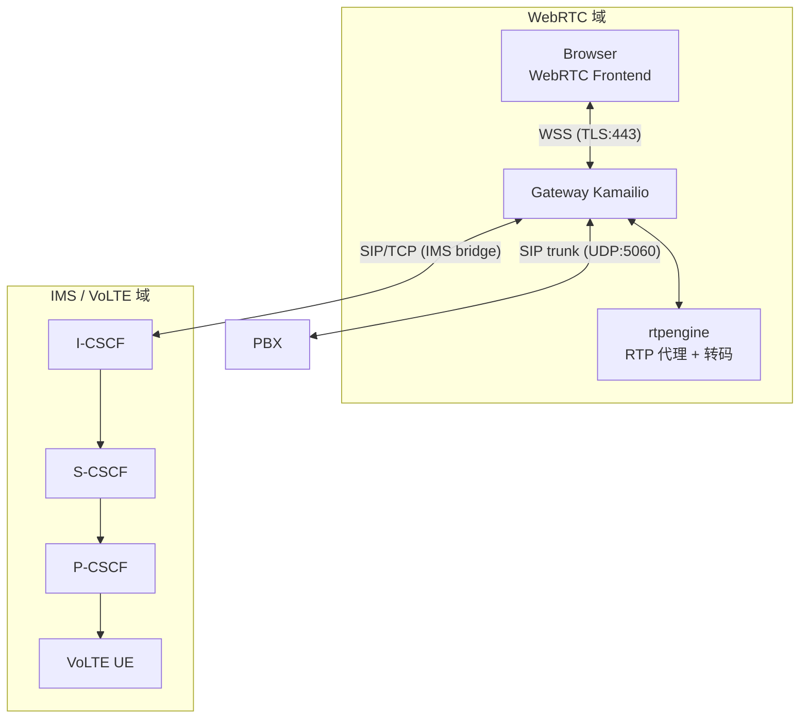
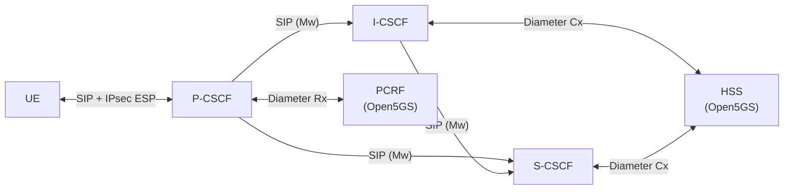
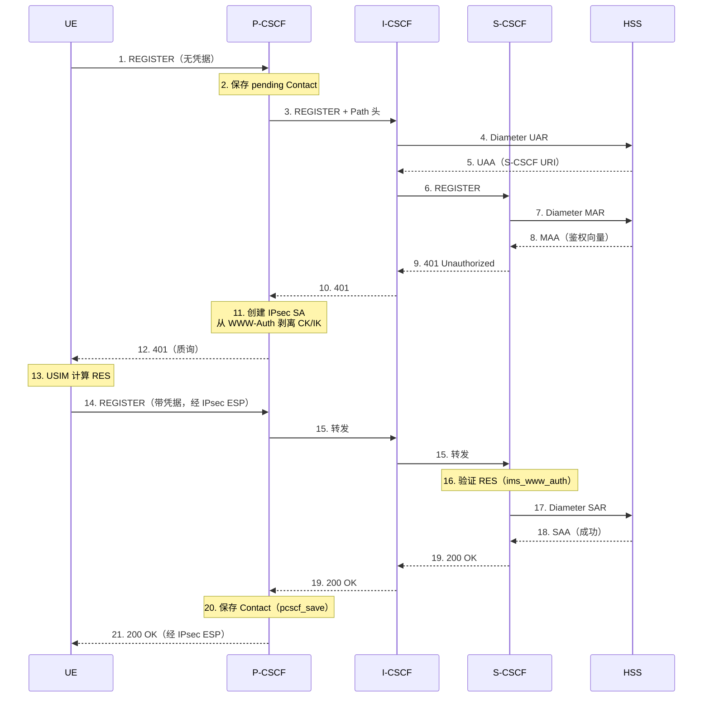
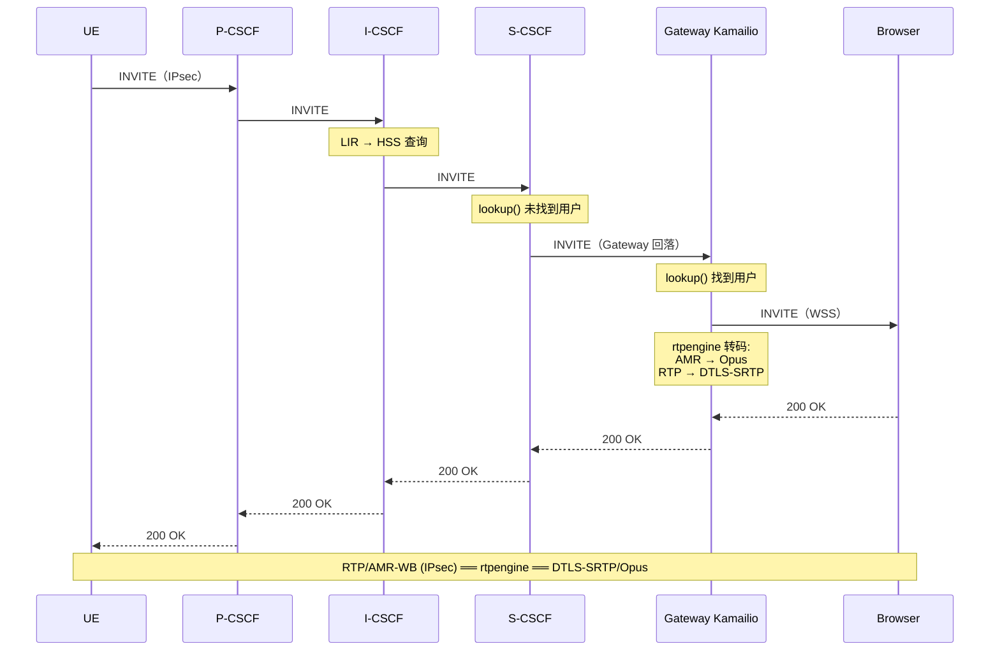

# Signal6A 系统架构

Signal6A 是一套将 VoLTE 移动通话与 WebRTC 网页电话前端打通的电话系统。本文档是该架构的完整参考，涵盖每个组件、SIP 路由规则、IMS CSCF 链、rtpengine 媒体转码，以及连接两个世界的双向桥接机制。

## 1. 总体架构

Signal6A 包含两个 SIP 域，通过可配置的桥接相连：



**左侧（WebRTC 域）：** React/Vite Web 电话通过 WSS 连接 Gateway Kamailio。该 Kamailio 负责浏览器用户的 SIP 注册，将通话路由到 PBX（传统 VoIP）或桥接到 IMS 域。

**右侧（IMS/VoLTE 域）：** 三个 Kamailio 实例实现 3GPP IMS CSCF 角色（P-CSCF、I-CSCF、S-CSCF）。它们通过 Diameter 与 Open5GS HSS 完成 VoLTE UE 鉴权，管理 IPsec 安全关联，并在 IMS 核心中路由通话。

**rtpengine** 位于中间，处理所有媒体：在 WebRTC 的加密 DTLS-SRTP/Opus 与 VoLTE 的明文 RTP/AMR-WB 之间转换，以及多网络接口的媒体锚定。

## 2. 组件清单

| 组件 | 实现 | 角色 |
|------|------|------|
| **Web Frontend** | React + Vite + JsSIP | 浏览器中的 WebRTC 软电话 |
| **Gateway Kamailio** | `nix/modules/kamailio.nix` | WebRTC-to-SIP 网关、用户注册、呼叫路由 |
| **rtpengine** | `nix/modules/rtpengine.nix` | RTP 媒体代理、SRTP↔RTP 桥接、编解码转码 |
| **P-CSCF** | `nix/modules/kamailio-ims.nix` (pcscfConfig) | IMS UE 入口、IPsec sec-agree、Diameter Rx |
| **I-CSCF** | `nix/modules/kamailio-ims.nix` (icscfConfig) | HSS 查询、S-CSCF 选择（Diameter Cx） |
| **S-CSCF** | `nix/modules/kamailio-ims.nix` (scscfConfig) | IMS 鉴权（AKAv1-MD5）、注册（SAR/SAA）、呼叫路由 |
| **Open5GS HSS** | 外部（Open5GS） | Home Subscriber Server，Diameter Cx 接口 |
| **Open5GS PCRF** | 外部（Open5GS） | 策略与计费规则，Diameter Rx 接口 |
| **signal6a-gateway** | `nix/modules/signal6a-gateway.nix` | 上层 NixOS 模块，组合 Kamailio + rtpengine |

## 3. Gateway Kamailio（WebRTC 侧）

Gateway Kamailio 是浏览器客户端的 SIP 服务器。它理解 WebSocket 传输、处理 WebRTC NAT 穿越、并决定将通话路由到本地用户、PBX 还是 IMS。

### 3.1 监听地址与协议

| 协议 | 地址 | 端口 | 用途 |
|------|------|------|------|
| UDP | `listenAddress` | 5060 | 标准 SIP，PBX/IMS 互通 |
| TCP | `listenAddress` | 5060 | 标准 SIP（TCP） |
| TLS | `listenAddress` | 5061 | 加密 SIP |
| TLS | `listenAddress` | `wssPort` (默认 443) | **WebSocket Secure** — 浏览器连接此端口 |

WSS 端口 443 上的 `xhttp` 模块处理 HTTP Upgrade 握手，`websocket` 模块管理 WebSocket 帧。

### 3.2 核心模块

- **tm / tmx**: 事务管理。有状态 SIP 处理。`fr_timer=30s`，`fr_inv_timer=120s`。
- **rr**: Record-Route 插入（INVITE/SUBSCRIBE），保证后续对话内请求经过此代理。
- **usrloc / registrar**: 内存用户位置数据库（`db_mode=0`），存储已注册用户的 Contact 绑定。`path` 支持 WebSocket 客户端。
- **websocket / xhttp**: WebSocket 传输，Keepalive `mechanism=1`（PING 帧），30 秒超时。
- **tls**: SIP-over-TLS 和 WSS 均使用。
- **nathelper**: NAT 检测与 keepalive。`nat_uac_test("19")` 检查 Via/Contact/SDP 与源 IP 不匹配。
- **rtpengine**: 通过 UDP 控制 rtpengine 守护进程（`udp:127.0.0.1:22222`）。
- **path**: Path 头支持。WebSocket 客户端注册时调用 `add_path_received()`。

### 3.3 请求路由管线

每个 SIP 请求遵循 `request_route` 管线：

```
request_route
  │
  ├─ REQINIT ──────── 完整性检查、Max-Forwards、OPTIONS keepalive
  ├─ NATDETECT ─────── force_rport()、fix_nated_register()、设置 flag 5
  │
  ├─ CANCEL? ──────── 匹配到事务则转发
  ├─ 重传检测 ──────── t_precheck_trans() / t_check_trans() 去重
  │
  ├─ INVITE|SUBSCRIBE → record_route()
  │
  ├─ WITHINDLG ─────── 对话内请求处理（有 To-tag）
  │   ├─ loose_route() 匹配 → DLGURI + RTPENGINE (ACK) 或 delete (BYE) → RELAY
  │   ├─ ACK 无路由匹配 → 有事务则转发
  │   └─ 其他 → 404 Not Here
  │
  ├─ REGISTER? ─────── REGISTRAR 路由（保存位置）
  │
  ├─ 无 user part? ──── 484 Address Incomplete
  │
  ├─ LOCATION ──────── 查找用户或决定外部路由
  └─ RELAY ─────────── RTPENGINE SDP 改写 + t_relay()
```

#### REQINIT

- `sanity_check("17895", "7")`：验证消息结构（CSeq、Content-Length、Via branch 等）
- `mf_process_maxfwd_header("10")`：递减 Max-Forwards，到零则 483
- 无 user part 的 OPTIONS 直接回复 200 Keepalive

#### NATDETECT

- `force_rport()`：始终在 Via 中添加 rport
- `nat_uac_test("19")`：位掩码 19 = 1 (Via) + 2 (Contact) + 16 (SDP body)，检测 NAT 后设 flag 5
- REGISTER 后 NAT：`fix_nated_register()` 将 Contact 改写为真实源地址
- 非 REGISTER 后 NAT：`set_contact_alias()` 在 Contact URI 中编码真实地址

### 3.4 REGISTER 处理

```
route[REGISTRAR]
  │
  ├─ WebSocket? → add_path_received()
  │     添加 Path 头，后续请求可通过正确的 WSS 连接路由到该用户
  │
  └─ save("location")
       将 Contact 绑定保存到内存 usrloc 表
       max_expires=3600 (1 小时)，gruu_enabled=0
```

当前 Gateway 侧无 SIP 鉴权——任何能访问 WSS 端口的客户端都可注册。鉴权委托给应用层。

### 3.5 LOCATION 查找与出站路由

`LOCATION` 路由决定如何送达通话：

```
route[LOCATION]
  │
  ├─ lookup("location") 成功?
  │   └─ 是 → 用户已在本地注册（WebRTC 用户），R-URI 改写为其 Contact，通话保持内部
  │
  └─ 否 → 用户本地未找到，三种可能：
      │
      ├─ IMS 桥接已启用 且 （无前缀过滤 或 号码匹配前缀）?
      │     改写 R-URI: sip:<号码>@<ims-domain>
      │     设置目标: sip:<icscf-host>:<icscf-port>;transport=tcp
      │     设置 bflag 10（外部通话标记）
      │     → 返回 RELAY
      │
      └─ 默认: 路由到 PBX
            设置目标: sip:<pbx-host>:<pbx-port>;transport=udp
            设置 bflag 10
            → 返回 RELAY
```

**bflag 10 至关重要**：标记通话为"外部"（跨网络边界）。RTPENGINE 路由根据此 flag 决定是否转码。无此 flag 时，WebRTC 到 WebRTC 通话保持 ICE/DTLS 完整；有此 flag 时，rtpengine 剥离 WebRTC 加密并为外部对端转码。

**IMS 前缀过滤**：当 `ims.prefix` 设置时（如 `"999"`），仅以该前缀开头的号码路由到 IMS。其他非本地号码走 PBX。前缀为空且 IMS 启用时，所有非本地通话走 IMS。

### 3.6 对话内路由

```
route[WITHINDLG]
  │
  ├─ 无 To-tag? → 返回（非对话内请求）
  │
  ├─ loose_route() 匹配（Record-Route 头存在）?
  │   ├─ DLGURI: handle_ruri_alias() 解析 NAT 联系人
  │   ├─ ACK → 运行 RTPENGINE（将 SDP answer 应用到媒体路径）
  │   ├─ BYE|CANCEL → rtpengine_delete()（拆除媒体会话）
  │   └─ RELAY
  │
  ├─ ACK 无路由匹配?
  │   └─ 有事务 → RELAY（覆盖 2xx 重传 ACK）
  │
  └─ 其他 → 404 Not Here
```

### 3.7 应答处理

**`onreply_route`（应用于所有回复）：**

1. **100rel/PRACK 剥离**：VoLTE UE 常发 `183 Session Progress` 带 `Require: 100rel`，期待 PRACK 响应。WebRTC 客户端（JsSIP）不支持 PRACK。网关从 180–199 临时回复中移除 `Require` 和 `RSeq` 头。
2. **NAT Contact 修复**：`fix_nated_contact()` 改写回复中的 Contact，`set_contact_alias()` 对 180–200 回复编码 WebSocket 别名。
3. **rtpengine SDP 处理**：`rtpengine_manage()` 在回复路由中（无参数调用）应用请求中设置的 SDP 改写的反向方向。

## 4. IMS CSCF 协议栈

IMS 协议栈由三个独立 Kamailio 进程实现，均在 `kamailio-ims.nix` 中定义。每个作为独立 systemd 服务运行，拥有各自的配置文件、监听地址和 Diameter 对等连接。

### 4.1 三个 CSCF：角色与连接



| CSCF | 默认监听 | 端口 | 功能 |
|------|----------|------|------|
| **P-CSCF** | UE 可达 IP（如 `10.45.0.1`） | 5060 | UE 首跳。IPsec sec-agree 处理。注册/通话转发到 IMS 核心。终结通话经 IPsec 回传 UE。 |
| **I-CSCF** | 内部（如 `127.0.0.21`） | 5062 | 接收 P-CSCF（或 Gateway 桥接）请求。查询 HSS 找到 S-CSCF。转发到对应 S-CSCF。 |
| **S-CSCF** | 内部（如 `127.0.0.22`） | 5064 | 核心会话控制。鉴权（MAR/MAA）、注册保存（SAR/SAA）、用户定位、呼叫路由或回落到 Gateway。 |

CSCF 间所有 SIP 流量使用 TCP。

### 4.2 Diameter 接口

| CSCF | Diameter 接口 | 对端 | Application ID | 用途 |
|------|---------------|------|----------------|------|
| P-CSCF | **Rx** | PCRF | 16777236 | 媒体承载 QoS 策略请求 |
| I-CSCF | **Cx** | HSS | 16777216 | UAR: 查找用户的 S-CSCF |
| | | | | LIR: 查找被叫用户的 S-CSCF |
| S-CSCF | **Cx** | HSS | 16777216 | MAR: 获取鉴权向量 |
| | | | | SAR: 注册为服务 S-CSCF |

Diameter 对等配置（XML 文件）指定 FQDN、Realm、`Vendor_Id 10415` (3GPP)、`security="none"`（`noTLS=true` 匹配 Open5GS 默认）、`ConnectTimeout` 5 秒。

### 4.3 P-CSCF：UE 入口

P-CSCF 是最复杂的 CSCF，需要处理：IPsec SA 管理、双向路由（发起/终结）、UE Contact 缓存。

#### P-CSCF 请求管线

```
request_route (P-CSCF)
  │
  ├─ REQINIT（同 Gateway: sanity, maxfwd, OPTIONS keepalive）
  ├─ NATDETECT（force_rport, nat_uac_test, set_contact_alias）
  ├─ CANCEL / 重传处理
  ├─ record_route()（INVITE|SUBSCRIBE）
  │
  ├─ WITHINDLG ─────── 对话内处理 + UE Contact 缓存
  │   ├─ loose_route() + 缓存 Contact 查找
  │   │   若对话有缓存 UE Contact ($sht(uecontact=>$ci))，
  │   │   设置 $du 为缓存地址，使请求经 IPsec 到达 UE
  │   ├─ 无 loose_route 但有缓存 Contact?
  │   │   使用缓存。BYE 时清除缓存。
  │   └─ ACK fallthrough → RELAY
  │
  ├─ REGISTER → PCSCF_REGISTER
  └─ 其他 → PCSCF_ROUTE
```

#### PCSCF_REGISTER：注册路径

```
route[PCSCF_REGISTER]
  │
  ├─ ipsec_forward("location", "1")
  │     若 IPsec 启用，解析 UE 的 IPsec SA 并建立安全端口路由
  │
  ├─ pcscf_save_pending("location")
  │     保存 UE Contact 为 "pending"，以便 401 回复到达时
  │     ipsec_create() 能找到 Contact 绑定 SA
  │
  ├─ add_path_received()
  │     插入 Path 头，后续请求将经 P-CSCF 路由
  │
  ├─ 追加 P-Visited-Network-ID 头（IMS 规范要求）
  │
  ├─ 设置目标 → I-CSCF (sip:<icscf-addr>:<port>;transport=tcp)
  │
  └─ t_on_reply("REGISTER_REPLY") → RELAY
```

#### REGISTER_REPLY：IPsec SA 建立

注册回复处理是创建 IPsec 安全关联的地方：

```
onreply_route[REGISTER_REPLY]
  │
  ├─ 401 Unauthorized?
  │   ├─ ipsec_create("location")
  │   │     使用 xfrm（Linux 内核 IPsec）创建 IPsec SA。
  │   │     401 中 WWW-Authenticate 包含 CK 和 IK，
  │   │     用于建立 ESP transport-mode SA。
  │   │
  │   ├─ 从 WWW-Authenticate 中剥离 CK/IK
  │   │     按 3GPP TS 33.203，P-CSCF 必须移除 CK 和 IK。
  │   │     UE 从 USIM 独立推导这些密钥。
  │   │
  │   └─ 追加 Require: sec-agree 和 Proxy-Require: sec-agree
  │
  └─ 200 OK?
      ├─ ipsec_forward("location", "1") — 经 IPsec 路由
      └─ pcscf_save("location") — 将 pending Contact 提升为 active
```

#### PCSCF_ROUTE：发起方向 vs. 终结方向

```
route[PCSCF_ROUTE]
  │
  ├─ pcscf_is_registered("location")?
  │   │
  │   ├─ 是 → 发起方向（请求来自已注册 UE）
  │   │   ├─ 缓存 UE 源地址: $sht(uecontact=>$ci) = sip:$si:$sp
  │   │   │   BYE 从远端到来时，P-CSCF 需知道 UE 的 IPsec 地址
  │   │   ├─ 设置目标 → I-CSCF
  │   │   └─ RELAY
  │   │
  │   └─ 否 → 终结方向（来自 IMS 核心 / Gateway 到 UE）
  │       ├─ 设置 flag 20（终结标记）
  │       ├─ ipsec_forward("location", "1") — 解析 UE 的 IPsec Contact
  │       ├─ 缓存解析后的 $du: $sht(uecontact=>$ci) = $du
  │       └─ RELAY
```

**htable** 模块提供 `$sht(uecontact=>...)` 哈希表（`size=8` 即 256 槽位，`autoexpire=120` 即 120 秒过期）。该缓存确保：
- UE 发起通话时，P-CSCF 缓存 `sip:<UE-IP>:<UE-port>`（以 Call-ID 为键）
- 远端发 BYE 时，BYE 到达 P-CSCF 无 IPsec 上下文，缓存让 P-CSCF 找到正确 SA 转发
- 终结通话同理：`ipsec_forward()` 解析 IPsec 目标后缓存，ACK 可达 UE

### 4.4 I-CSCF：HSS 查询器

I-CSCF 最简单，唯一职责是查询 HSS 并转发到正确的 S-CSCF。

#### ICSCF_REGISTER：UAR 到 HSS

```
route[ICSCF_REGISTER]
  │
  ├─ t_newtran() — 为异步 Diameter 创建事务
  │
  ├─ I_perform_user_authorization_request("UAR_CALLBACK", "0")
  │     发送 Diameter UAR 到 HSS，作用：
  │       1. 在 HSS 中建立 IMPI↔IMPU 关联
  │       2. 返回 HSS 中的 S-CSCF URI
  │
  └─ 异步退出（HSS 响应后触发回调）

route[UAR_CALLBACK]
  │
  ├─ uaa_return_code == 1 或 2（成功）?
  │   └─ I_scscf_select("0") — 从 HSS 响应中选择 S-CSCF
  │
  ├─ 恢复 R-URI: $ru = "sip:" + $td
  │     I_scscf_select 会将 $ru 改写为 HSS 中的 S-CSCF URI，
  │     需恢复为原始域使 S-CSCF 看到正确的 R-URI
  │
  ├─ 设置目标 → 本地 S-CSCF (sip:<scscf-addr>:<port>;transport=tcp)
  └─ t_relay()
```

**Open5GS 集成说明**：UAR→UAA 要返回正确的 S-CSCF 地址，每个订阅者的 MongoDB 记录中必须设置 `ims.server_name` 字段。NixOS 模块的 `open5gsIntegration` 选项通过 mongosh 脚本自动设置。

#### ICSCF_ROUTE：非 REGISTER 请求（LIR）

```
route[ICSCF_ROUTE]
  │
  ├─ I_scscf_select("1")
  │     发送 Diameter LIR 到 HSS 查找被叫用户的 S-CSCF
  │     参数 "1" 表示 "session/call"（对比 "0" 用于注册）
  │
  ├─ LIR 失败 → 使用默认 S-CSCF 地址
  └─ RELAY
```

I-CSCF 维护一个 **db_text** 数据库，包含：`s_cscf`（S-CSCF ID 到 URI 映射）、`nds_trusted_domains`（可信域列表）、`s_cscf_capabilities`（能力值）。

### 4.5 S-CSCF：会话控制器

S-CSCF 是 IMS 核心的大脑，处理鉴权、注册存储和呼叫路由。

#### SCSCF_REGISTER：鉴权与存储

```
route[SCSCF_REGISTER]
  │
  ├─ t_newtran()
  │
  ├─ ims_www_authenticate("$fd")
  │     检查请求中是否有有效凭据。返回值：
  │        1 = 鉴权成功
  │       -1 = 无凭据（首次 REGISTER）
  │       -2 = 鉴权失败
  │       -3 = HSS 错误
  │
  ├─ 结果 == -1（无凭据）?
  │   └─ ims_www_challenge("AUTH_CHALLENGE_REPLY", "$fd")
  │        发送 Diameter MAR 到 HSS，获取 AKAv1-MD5 鉴权向量
  │        S-CSCF 生成 401 + WWW-Authenticate（包含 nonce、CK、IK）
  │
  ├─ 结果 < 0（错误）?
  │   └─ 403 Forbidden
  │
  └─ 结果 >= 0（已鉴权）?
      └─ save("SAR_REPLY", "location")
           发送 Diameter SAR 到 HSS，告知 "我是该用户的服务 S-CSCF"
           HSS 以 SAA 响应，成功则 Contact 保存到 ims_usrloc_scscf
```

**鉴权流程**：IMS 使用 AKAv1-MD5（3GPP TS 33.203）。首次 REGISTER 无凭据 → S-CSCF 通过 MAR 从 HSS 获取鉴权向量 → 401 质询携带 RAND+AUTN 的 nonce → UE 的 USIM 用密钥计算 RES → 重发 REGISTER 带凭据 → S-CSCF 验证 RES 与 HSS 的 XRES 匹配。

#### SCSCF_ROUTE：呼叫路由

```
route[SCSCF_ROUTE]
  │
  ├─ lookup("location", "")
  │     在 ims_usrloc_scscf 中搜索被叫用户
  │
  ├─ 找到?
  │   └─ R-URI 改写为用户注册的 Contact → RELAY
  │       Contact 通常指向 P-CSCF（通过 Path），
  │       请求将走: S-CSCF → P-CSCF → UE
  │
  └─ 未找到?
      │
      ├─ Gateway 回落启用 且 请求非来自 Gateway?
      │     改写 R-URI 域为 Gateway 域
      │     设置目标 → Gateway Kamailio 地址
      │     → RELAY
      │
      └─ 404 User Not Found
```

Gateway 回落检查（`$si != gateway.host`）防止路由环路：若请求已经来自 Gateway 且用户未在 IMS 中找到，则返回 404 而非将请求弹回。

## 5. IMS 注册流程（完整步骤）

VoLTE UE 注册时的端到端完整流程：



## 6. IMS 通话流程（完整步骤）

VoLTE 发起通话到 WebRTC 用户（桥接模式）：



## 7. 桥接：WebRTC ↔ IMS

桥接通过 Gateway Kamailio 和 S-CSCF 上的协调路由规则实现，均通过 NixOS 选项配置。

### 7.1 WebRTC → VoLTE 方向

配置项：`services.kamailio.ims.*`

当 WebRTC 用户拨号且号码未在 Gateway 本地 usrloc 中找到时：

1. **Gateway LOCATION 路由**检查 IMS 桥接是否启用，号码是否匹配 IMS 前缀
2. **R-URI 改写**：`$ru = "sip:" + $rU + "@" + ims.domain`（如 `sip:1234567890@ims.mnc044.mcc999.3gppnetwork.org`）
3. **目标设置**：`$du = "sip:" + icscfHost + ":" + icscfPort + ";transport=tcp"`
4. **bflag 10** 标记为外部通话，触发 rtpengine 转码
5. I-CSCF 查询 HSS → S-CSCF 查找用户 → P-CSCF → UE

### 7.2 VoLTE → WebRTC 方向

配置项：`services.kamailio-ims.scscf.gateway.*`

当 VoLTE UE 拨号且 S-CSCF 在 IMS usrloc 中未找到该号码时：

1. **S-CSCF SCSCF_ROUTE**检查 Gateway 回落是否启用
2. **环路防护**：若请求已来自 Gateway（`$si == gateway.host`），返回 404
3. **R-URI 域改写**（可选）：若配置了 `gateway.domain`
4. **目标设置**：`$du = "sip:" + gateway.host + ":" + gateway.port + ";transport=tcp"`
5. Gateway 收到请求，LOCATION 查找到 WebRTC 用户，经 WebSocket 送达

### 7.3 环路防护

S-CSCF 的环路防护简单有效：比较 `$si`（入站源 IP）与配置的 `gateway.host`。相同则请求已经过 Gateway，不应再送回。

Gateway 侧无显式环路防护，因为其 IMS 路由仅在 `lookup("location")` 失败时激活。找到用户则直接送达；未找到送到 IMS 后，IMS 侧会送达 VoLTE UE 或返回错误——不会因 S-CSCF 的检查而弹回 Gateway。

### 7.4 PBX 与 IMS 共存

`ims.prefix` 选项支持同一 Gateway 上同时路由 PBX 和 IMS：

| 配置 | 行为 |
|------|------|
| `prefix = ""`（空） | 所有非本地通话走 IMS（PBX 路由禁用） |
| `prefix = "999"` | 仅 `999` 开头走 IMS，其余走 PBX |
| `ims.enable = false` | 所有非本地通话走 PBX |

## 8. 媒体路径与转码（rtpengine）

### 8.1 rtpengine 的功能

rtpengine 是用户态 RTP 代理，在 Signal6A 中执行三个关键功能：

1. **加密桥接**：WebRTC 要求 DTLS-SRTP，VoLTE 使用明文 RTP（网络层由 IPsec 保护）。rtpengine 在 WebRTC 侧终结 DTLS-SRTP，在 IMS/PBX 侧收发明文 RTP。
2. **编解码转码**：WebRTC 使用 Opus，VoLTE 使用 AMR-WB（或 AMR-NB、G.711）。rtpengine 实时转码。
3. **网络接口锚定**：多宿主部署中，每条通话腿绑定不同网络接口（如公网 IP 用于 WebRTC，内网/隧道 IP 用于 IMS）。

### 8.2 多接口设置

```nix
services.rtpengine.interfaces = {
  external = "203.0.113.50";   # WebRTC 客户端的公网 IP
  internal = "10.45.0.1";      # IMS APN 接口 (ogstun)
};
```

生成：`interface = external/203.0.113.50;internal/10.45.0.1`

Kamailio 通过 `direction=` flag 引用这些名称：
- `rtpengine.direction = "external"` — WebRTC/本地侧
- `rtpengine.directionIms = "internal"` — IMS/PBX 侧

### 8.3 Gateway Kamailio rtpengine 规则

`RTPENGINE` 路由包含核心转码逻辑，对携带 SDP body 的 INVITE/UPDATE/PRACK 调用：

```
route[RTPENGINE]
  │
  ├─ 无 SDP body? → 返回
  │
  ├─ 请求来自 WebSocket (ws/wss)?
  │   │
  │   ├─ bflag 10（外部通话）?
  │   │   │
  │   │   │  WebRTC → SIP/VoLTE（出站到 PBX 或 IMS）
  │   │   │
  │   │   │  rtpengine_manage(
  │   │   │    "RTP/AVP"                    ← 输出明文 RTP
  │   │   │    "replace-origin"             ← SDP origin 改写到 rtpengine
  │   │   │    "ICE=remove"                 ← 剥离 ICE candidates
  │   │   │    "rtcp-mux-demux"             ← RTCP 拆分到独立端口
  │   │   │    "transcode=AMR-WB"           ← 添加 AMR-WB（VoLTE 主选）
  │   │   │    "transcode=AMR"              ← 添加 AMR-NB（VoLTE 备选）
  │   │   │    "transcode=PCMA"             ← 添加 G.711 A-law（PBX/PSTN）
  │   │   │    "transcode=PCMU"             ← 添加 G.711 μ-law（PBX/PSTN）
  │   │   │    "direction=external"         ← WebRTC 侧公网接口
  │   │   │    "direction=internal"         ← SIP 侧内网接口
  │   │   │  )
  │   │   │
  │   │   │  SDP 从 WebRTC 格式转换：
  │   │   │    m=audio ... UDP/TLS/RTP/SAVPF 111
  │   │   │    a=rtpmap:111 opus/48000/2
  │   │   │    a=ice-ufrag:...  a=fingerprint:sha-256 ...
  │   │   │    a=rtcp-mux
  │   │   │
  │   │   │  为 SIP/VoLTE 格式：
  │   │   │    m=audio ... RTP/AVP 112 118 8 0
  │   │   │    a=rtpmap:112 AMR-WB/16000/1
  │   │   │    a=rtpmap:118 AMR/8000/1
  │   │   │    a=rtpmap:8 PCMA/8000
  │   │   │    a=rtpmap:0 PCMU/8000
  │   │   │
  │   │   └─ 完成
  │   │
  │   └─ bflag 10 未设置（WebRTC-to-WebRTC 内部通话）?
  │         rtpengine_manage(
  │           "trust-address" "replace-origin" "direction=external"
  │         )
  │         无转码、无 ICE 移除、无 DTLS 剥离。媒体最小修改通过。
  │
  └─ 请求非来自 WebSocket（明文 SIP）?
        SIP/VoLTE → WebRTC（来自 PBX 或 IMS 的入站）

        rtpengine_manage(
          "UDP/TLS/RTP/SAVPF"            ← 输出 DTLS-SRTP（WebRTC 要求）
          "ICE=force"                    ← 生成 ICE candidates
          "DTLS=passive"                 ← rtpengine 作为 DTLS server
          "rtcp-mux-require"             ← RTCP 复用同一端口
          "transcode=opus"               ← 转码到 Opus
          "direction=external"           ← WebRTC 侧公网接口
          "direction=internal"           ← SIP 侧内网接口
        )

        SDP 从 SIP/VoLTE 格式转换为 WebRTC 格式（Opus + ICE + DTLS + rtcp-mux）
```

### 8.4 编解码协商

rtpengine 构建（`nix/rtpengine.nix`）包含的编解码库：

| 库 | 提供的编解码 | 用途 |
|----|-------------|------|
| `libopus` | Opus | WebRTC 音频（WebRTC 规范强制） |
| `opencore-amr` | AMR-NB, AMR-WB 解码 | VoLTE 音频解码 |
| `vo-amrwbenc` | AMR-WB 编码 | VoLTE 音频编码 |
| `spandsp3` | G.711, T.38 等 | PSTN/PBX 互通 |
| `ffmpeg-full` | 其他 | 备选编解码支持 |

WebRTC→VoLTE 通话的转码链：Browser 发送 Opus (48kHz) → rtpengine 解码 → 编码为 AMR-WB (16kHz) 或 AMR-NB (8kHz) → VoLTE UE 接收。反向同理。

### 8.5 回复侧 SDP 处理

Gateway 的 `onreply_route` 中，`rtpengine_manage()` 无参数调用处理任何携带 SDP 的回复。初始 INVITE 设置 SDP *offer*，200 OK（或 183）携带 SDP *answer*。回复路由中的调用完成媒体协商并激活媒体路径。rtpengine 通过 Call-ID 和 From-tag 内部关联 offer/answer。

## 9. IPsec / sec-agree（VoLTE 安全）

VoLTE 要求 UE 与 P-CSCF 之间使用 IPsec ESP transport mode，通过 SIP `sec-agree`（RFC 3329 + 3GPP TS 33.203）协商。

### 端口分配

| 端口类型 | 默认起始 | 数量 | 用途 |
|----------|----------|------|------|
| Server 端口 | 6100 | `maxConnections`（默认 10） | SA 建立后 UE 向这些端口发 SIP |
| Client 端口 | 5100 | `maxConnections`（默认 10） | P-CSCF 从这些端口向 UE 发 SIP |

每个并发 UE 注册消耗一个 server 端口和一个 client 端口。

### SPI 分配

Security Parameter Index 从 `spiIdStart`（默认 1000）开始，范围 `spiIdRange`（默认 1000）。低于 256 的 SPI 为 IANA 保留。

### 算法协商

- 完整性：`hmac-sha-1-96`（首选）
- 加密：`aes-cbc`（默认）、`null`（调试用）、`des-ede3-cbc`

P-CSCF 使用 Linux 内核 xfrm（通过 netlink）管理 IPsec SA，需要 `CAP_NET_ADMIN`。防火墙开放 IP 协议 50（ESP）：`ip protocol esp accept`。

## 10. NixOS 部署模型

系统以 NixOS 模块 + Flake 接口打包：

```
signal6a/
├── nix/
│   ├── kamailio.nix              ← 包: Kamailio 6.0.3 + IMS 模块
│   ├── rtpengine.nix             ← 包: rtpengine mr13.0.1.1 + 转码
│   └── modules/
│       ├── kamailio.nix          ← 模块: Gateway Kamailio (services.kamailio)
│       ├── kamailio-ims.nix      ← 模块: IMS CSCF (services.kamailio-ims)
│       ├── rtpengine.nix         ← 模块: rtpengine (services.rtpengine)
│       └── signal6a-gateway.nix  ← 模块: 上层 Gateway (services.signal6a-gateway)
```

**`signal6a-gateway`** 是便捷模块，将 `kamailio` 和 `rtpengine` 以合理默认值组合。接受 `publicIP`、`domain`、`pbx` 配置和 TLS 证书，配置两个服务。

### Systemd 服务

| 服务 | 模块 | 用户 | Capabilities |
|------|------|------|-------------|
| `kamailio` | kamailio.nix | kamailio | `CAP_NET_BIND_SERVICE` |
| `kamailio-pcscf` | kamailio-ims.nix | kamailio | `CAP_NET_BIND_SERVICE`, `CAP_NET_ADMIN` |
| `kamailio-icscf` | kamailio-ims.nix | kamailio | `CAP_NET_BIND_SERVICE` |
| `kamailio-scscf` | kamailio-ims.nix | kamailio | `CAP_NET_BIND_SERVICE` |
| `rtpengine` | rtpengine.nix | rtpengine | `CAP_NET_BIND_SERVICE`, `CAP_NET_ADMIN` |
| `kamailio-tls-certs` | kamailio-ims.nix | root | 生成自签名 TLS 证书 |
| `kamailio-ims-provision` | kamailio-ims.nix | root | 在 Open5GS MongoDB 中预配 IMS 数据 |

## 11. 网络拓扑参考

参考部署（来自 `ims-volte-configuration.nix`）：

```
┌─────────────────────────────────────────────────────────────────────────┐
│  主机                                                                    │
│                                                                          │
│  ┌─────────────────────┐     ┌──────────────────────────────────────┐   │
│  │ 公网接口              │     │ Loopback + ogstun 接口               │   │
│  │                      │     │                                      │   │
│  │ Gateway Kamailio     │     │ P-CSCF     10.45.0.1:5060           │   │
│  │ <public-ip>:443 WSS  │     │            (ogstun, UE 可达)         │   │
│  │ <public-ip>:5060 SIP │     │                                      │   │
│  │                      │     │ I-CSCF     127.0.0.21:5060          │   │
│  │ rtpengine            │     │            (loopback, 内部)           │   │
│  │ external/<public-ip> │     │                                      │   │
│  │ internal/ogstun      │     │ S-CSCF     127.0.0.22:5060          │   │
│  │ UDP 30000-40000      │     │            (loopback, 内部)           │   │
│  │                      │     │                                      │   │
│  │ PBX                  │     │ HSS        127.0.0.8:3868           │   │
│  │ <pbx-host>:5160 SIP  │     │ PCRF       127.0.0.9:3868           │   │
│  └─────────────────────┘     └──────────────────────────────────────┘   │
│                                                                          │
│  /etc/hosts:                                                             │
│    127.0.0.8   hss.localdomain                                          │
│    127.0.0.9   pcrf.localdomain                                         │
│    10.45.0.1   pcscf.localdomain                                        │
│    127.0.0.21  icscf.localdomain                                        │
│    127.0.0.22  scscf.localdomain                                        │
└─────────────────────────────────────────────────────────────────────────┘
```

## 12. 已知问题与 TODO

- **P-CSCF 终结通话路由**：`PCSCF_ROUTE` 在请求既非明确发起也非明确终结时存在边缘情况。`pcscf_is_registered()` 检查适用于常见场景，但某些 re-INVITE 或 SUBSCRIBE 场景可能失败。
- **reg-event SUBSCRIBE/NOTIFY**：UE 注册事件订阅处理不完整。S-CSCF 对 reg-event SUBSCRIBE 回复 200 OK，但不发送正确的 NOTIFY。某些 UE 可能因未收到及时 NOTIFY 而掉注册。
- **ipsec_reuse_server_port**：尽管 `ipsec_reuse_server_port=1`，观察到 server 端口分配仍递增。目前通过监听一个范围的端口缓解。
- **Gateway 鉴权**：WebRTC 网关侧无 SIP 鉴权。任何能访问 WSS 端口的客户端均可注册和拨打电话。
- **IMS 侧无 SRTP**：rtpengine 与 P-CSCF/UE 之间使用明文 RTP（由 IPsec 在网络层保护）。rtpengine↔P-CSCF 路径必须在可信网络上。
- **ISC/iFC 未启用**：S-CSCF 有 IMS 业务控制（AS 触发 via iFC）的存根代码，但目前被注释掉。
