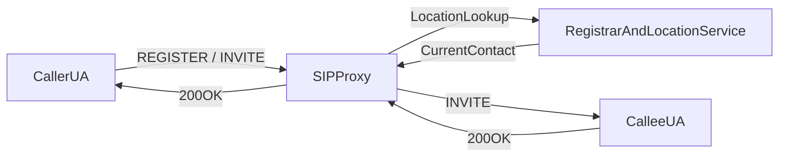
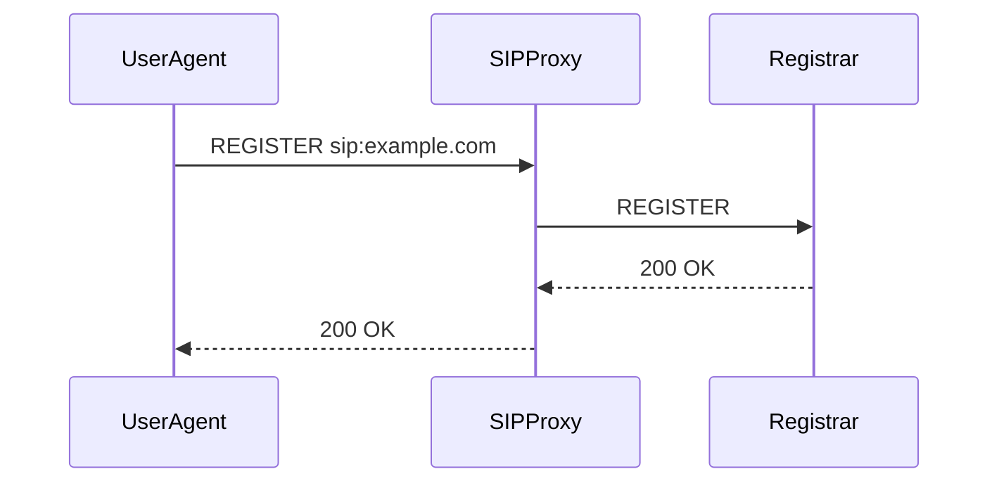
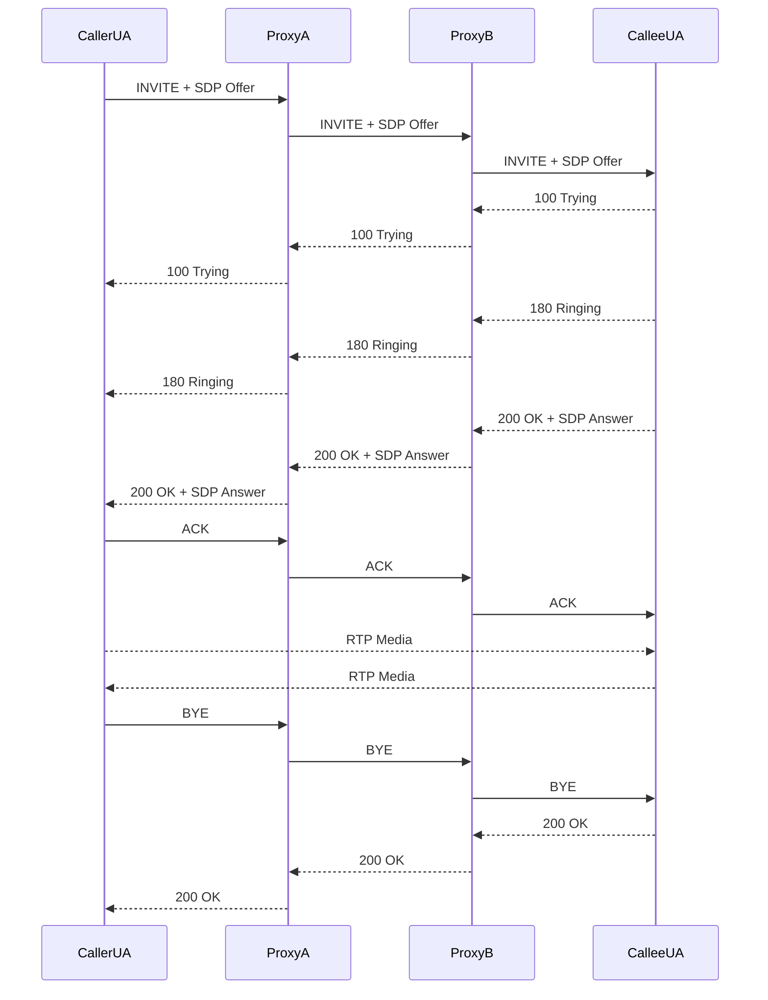
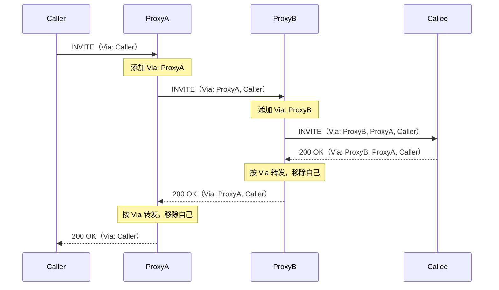
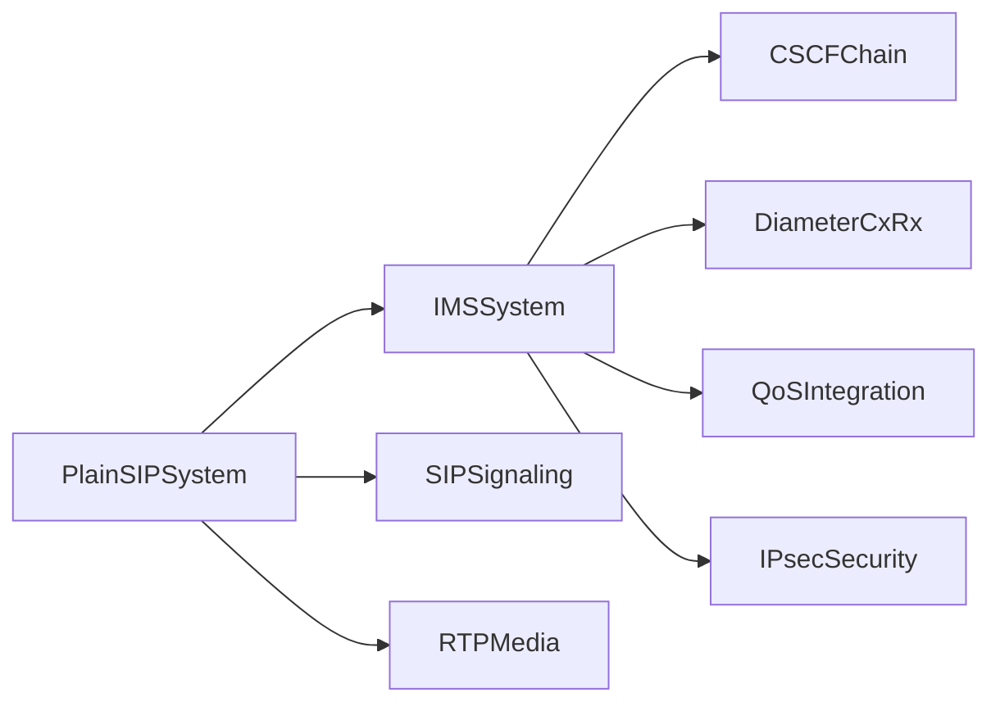

# SIP 协议基础与 IP 电话原理

在进入 IMS 之前，先理解 SIP 和 IP 电话的基本工作方式会更容易。  
本页从“传统电话系统”过渡到“纯 SIP 系统”，再连接回 IMS。

## 从传统电话到 IP 电话

- 传统 PSTN 语音多基于电路交换，一次通话占用固定链路
- IP 电话（VoIP）基于分组交换，把“信令控制”和“媒体传输”分开
- 常见分工是：**SIP 负责信令**，**RTP 负责语音媒体**

这也是后续理解 VoLTE/VoNR 的关键：IMS 主要增强和规范的是 SIP 信令控制链路。

## 什么是 SIP

SIP（Session Initiation Protocol）是文本协议，风格类似 HTTP，采用请求/响应模型。  
一个典型 SIP URI 形如：`sip:alice@example.com`。

常见 SIP 角色：

- **UA（User Agent）**：终端（手机、软电话）发起和接收 SIP 消息
- **Registrar**：处理 `REGISTER`，维护用户当前 Contact
- **Proxy**：按路由策略转发请求/应答
- **Redirect Server**：不转发请求，返回新的目标地址给请求方

## 常见 SIP 方法

| 方法 | 用途 |
|------|------|
| `REGISTER` | 用户向 Registrar 注册当前可达地址 |
| `INVITE` | 发起会话（语音/视频） |
| `ACK` | 确认最终应答（通常是 2xx） |
| `BYE` | 主动结束已建立会话 |
| `CANCEL` | 取消尚未建立成功的呼叫 |
| `OPTIONS` | 能力探测与连通性检查 |
| `UPDATE` | 会话中更新 SDP（不创建新对话） |

## 常见 SIP 响应码

| 类别 | 含义 | 常见码 |
|------|------|--------|
| 1xx | 临时应答（呼叫处理中） | `100 Trying`, `180 Ringing` |
| 2xx | 成功 | `200 OK` |
| 3xx | 重定向 | `302 Moved Temporarily` |
| 4xx | 客户端请求错误 | `401 Unauthorized`, `404 Not Found`, `486 Busy Here` |
| 5xx | 服务器侧错误 | `500 Server Internal Error` |
| 6xx | 全局失败 | `603 Decline` |

## 纯 SIP 架构（不含 IMS）



上图是最小化 VoIP 思路：终端先注册，再通过代理按位置库路由通话。

## SIP 注册流程（REGISTER）



实际部署中经常会加鉴权挑战：

- 首次 `REGISTER` 可能返回 `401 Unauthorized`
- UA 带 Digest 凭据重发 `REGISTER`
- 校验成功后返回 `200 OK`

## SIP 呼叫建立流程（INVITE Trapezoid）



## SIP 路由机制：Via 与 Record-Route

上面的流程中，请求经过多个 Proxy 转发，响应又能原路返回——这是靠 SIP 头域中的路由机制实现的。理解这些头域对后续阅读 CSCF 和 Kamailio 配置非常有帮助。

### Via：响应的回程路径

每个 Proxy 转发请求时，会在消息顶部**添加一条自己的 Via 头**。被叫端收到的 INVITE 可能包含多条 Via，从上到下依次是最近的 Proxy 到最远的发起方：

```
Via: SIP/2.0/TCP proxyB.example.com;branch=z9hG4bK-002
Via: SIP/2.0/TCP proxyA.example.com;branch=z9hG4bK-001
Via: SIP/2.0/UDP caller.example.com;branch=z9hG4bK-000
```

当被叫端发送响应（如 `200 OK`）时，每个 Proxy **按最顶部的 Via 找到上一跳**，转发后**移除自己那条 Via**，这样响应就沿原路一跳一跳回到发起方。



`branch` 参数是每条 Via 的事务标识符，Proxy 用它来将响应匹配到对应的请求事务。

### Record-Route：对话内请求的路径

Via 只解决"响应怎么回来"。但通话建立后，后续的对话内请求（如 `BYE`、`re-INVITE`）怎么知道还要经过哪些 Proxy？

答案是 **Record-Route**：Proxy 在转发 INVITE 时可以插入 `Record-Route` 头，声明"后续对话内请求也必须经过我"。对端收到后将这些地址保存为 **Route Set**，后续的 BYE 等请求按 Route Set 发送，确保仍经过相同的 Proxy 链。

| 头域 | 谁添加 | 何时使用 | 作用 |
|------|--------|----------|------|
| **Via** | 每个 Proxy 转发请求时 | 响应回程 | 让响应沿原路返回，每跳剥离一条 |
| **Record-Route** | 希望留在信令路径上的 Proxy | 对话内后续请求 | 让 BYE/re-INVITE 等仍经过该 Proxy |
| **Route** | UA 根据收到的 Record-Route 生成 | 发送对话内请求时 | 指定请求要经过的 Proxy 列表 |
| **Contact** | UA 或 Proxy | 建立对话时 | 告知对端自己的直接可达地址 |

::: tip 与 IMS 的联系
在 IMS 中，P-CSCF 和 S-CSCF 都会插入 `Record-Route`，这样通话建立后的 BYE、re-INVITE 仍然经过 CSCF 链，CSCF 才能做媒体控制（如 rtpengine 拆除）和计费。这不是 IMS 发明的，而是标准 SIP 的 `Record-Route` 机制——IMS 只是强制要求 CSCF 必须使用它。详见 [CSCF 三大网元详解](/ims/cscf)。
:::

## SDP 与媒体协商（Offer/Answer）

SIP 消息中的媒体参数通常由 SDP 承载：

- `m=`：媒体类型与端口（如音频）
- `c=`：连接地址（IP）
- `a=`：媒体属性（编解码、方向、RTCP、加密参数等）

典型模式是：

1. 主叫在 `INVITE` 携带 SDP Offer
2. 被叫在 `200 OK` 返回 SDP Answer
3. 双方据此确定编解码和媒体端口

## RTP：媒体面

SIP 只管“怎么建立/结束会话”，不直接承载语音流。  
语音通常走 RTP（或加密版 SRTP），并使用与 SIP 不同的端口和路径。

这也是为什么很多系统会出现“信令通了但没声音”：信令面（SIP）和媒体面（RTP）需分别排障。

## SIP 与 IMS 的关系

IMS 不是替代 SIP，而是在运营商级网络里对 SIP 做体系化增强：

- 增加 CSCF 链路（P-CSCF / I-CSCF / S-CSCF）
- 用 Diameter 对接 HSS 做鉴权和用户资料管理
- 与 PCRF/PCF 联动 QoS 策略
- 增加 IPsec/sec-agree 等移动网络安全机制



继续阅读：

- [CSCF 三大网元详解](/ims/cscf)
- [IMS 注册与入网流程](/ims/registration)
