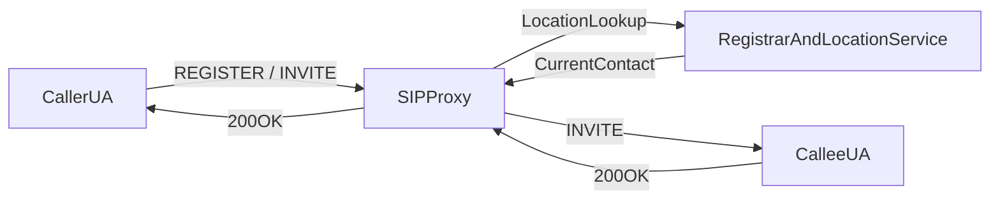
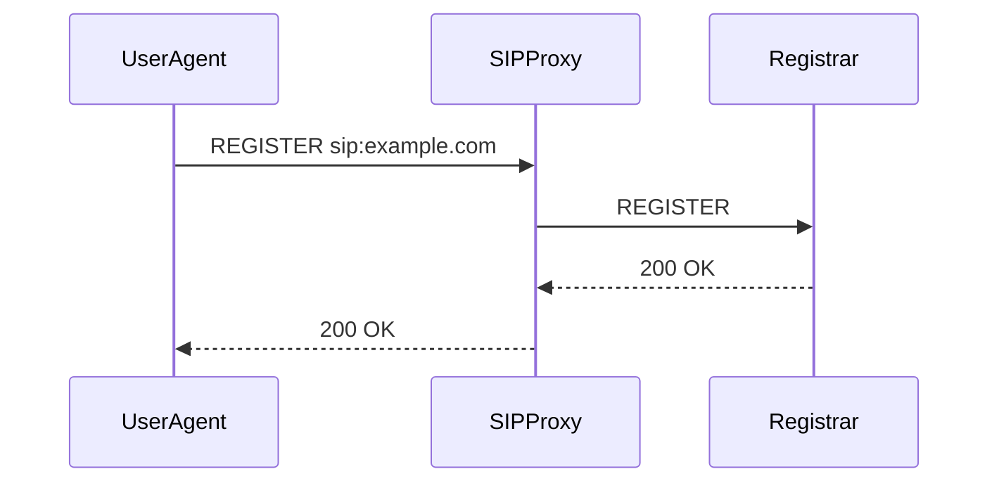
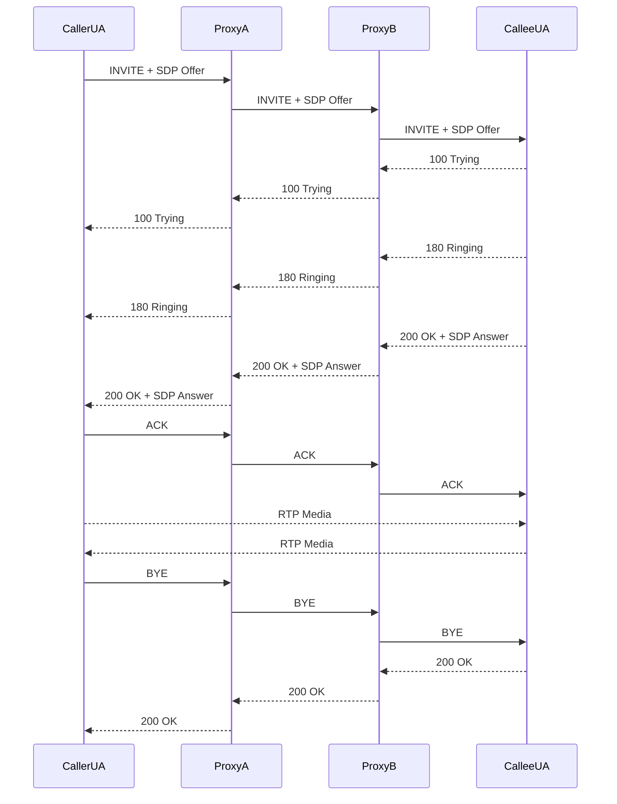
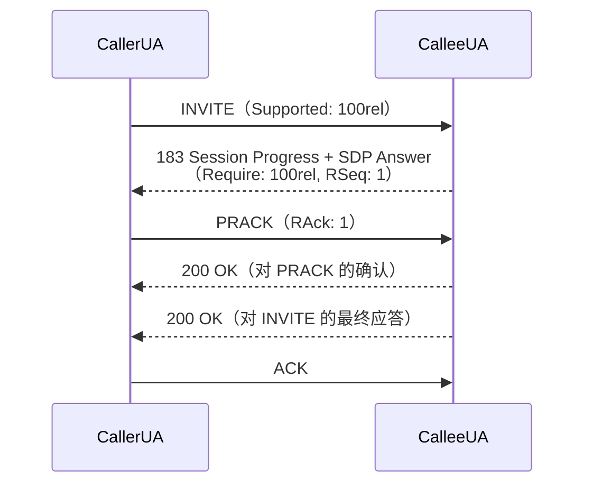
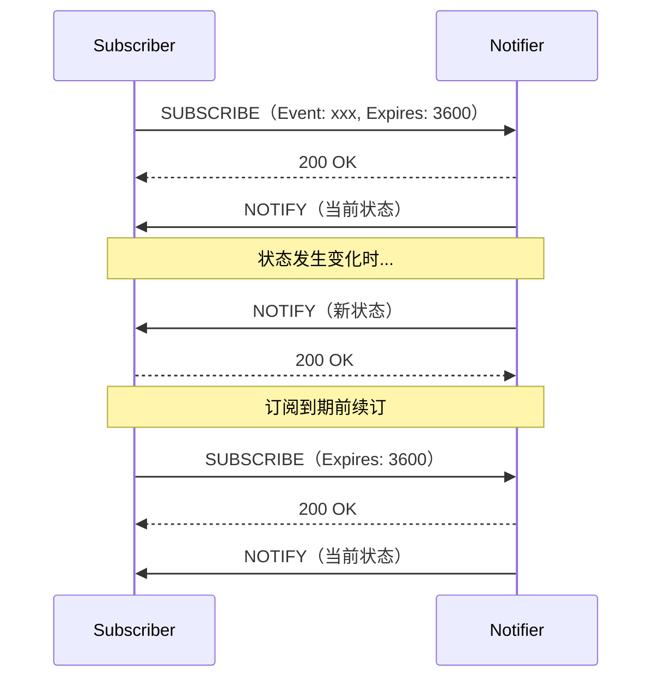
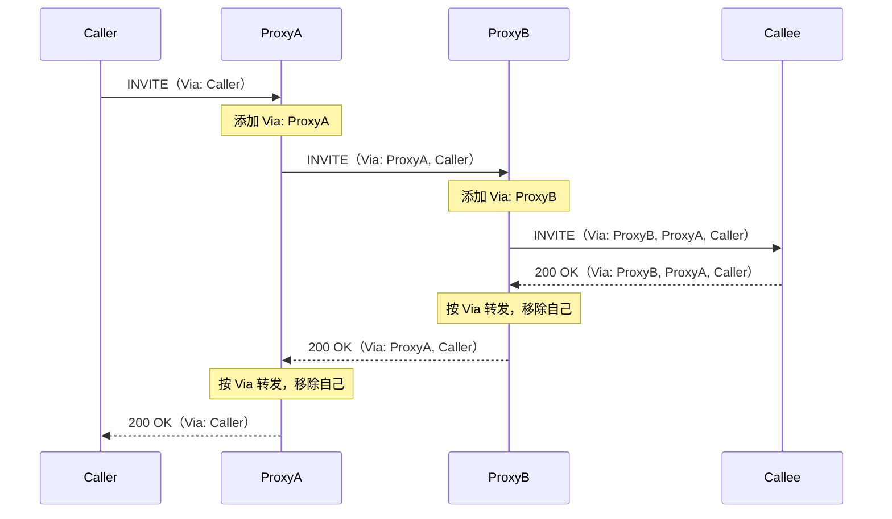
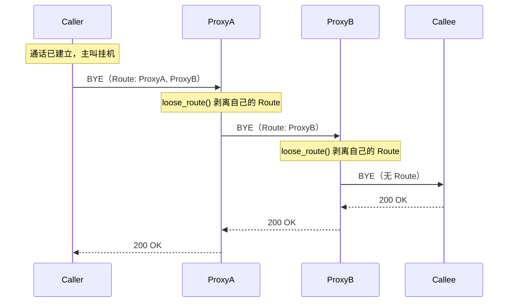
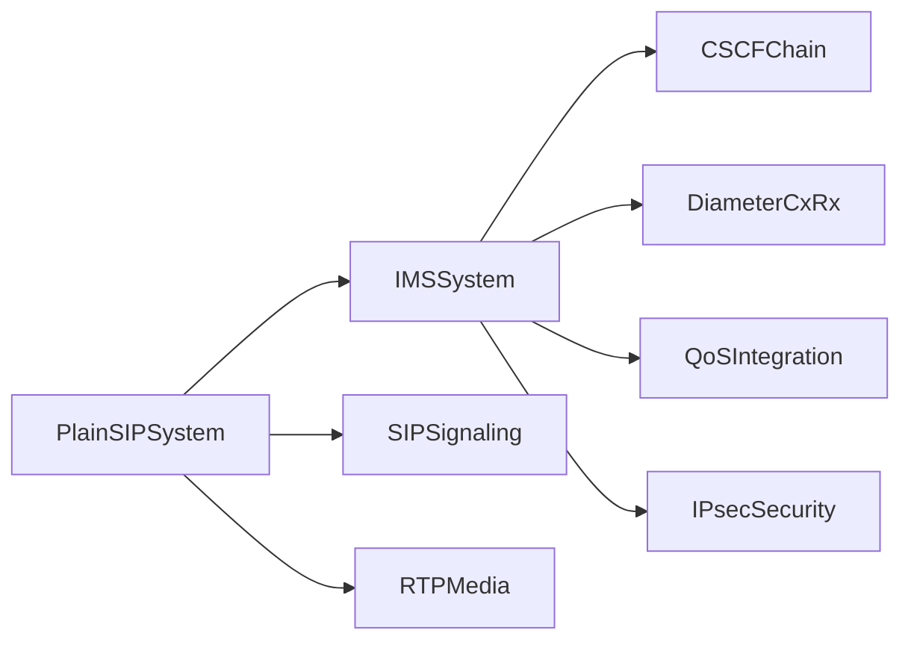

# SIP 协议基础与 IP 电话原理

在进入 IMS 之前，先理解 SIP 和 IP 电话的基本工作方式会更容易。  
本页从“传统电话系统”过渡到“纯 SIP 系统”，再连接回 IMS。

## 从传统电话到 IP 电话

- 传统 PSTN 语音多基于电路交换，一次通话占用固定链路
- IP 电话（VoIP）基于分组交换，把“信令控制”和“媒体传输”分开
- 常见分工是：**SIP 负责信令**，**RTP 负责语音媒体**

这也是后续理解 VoLTE/VoNR 的关键：IMS 主要增强和规范的是 SIP 信令控制链路。

## 什么是 SIP

SIP（Session Initiation Protocol）是文本协议，风格类似 HTTP，采用请求/响应模型。  
一个典型 SIP URI 形如：`sip:alice@example.com`。

常见 SIP 角色：

- **UA（User Agent）**：终端（手机、软电话）发起和接收 SIP 消息
- **Registrar**：处理 `REGISTER`，维护用户当前 Contact
- **Proxy**：按路由策略转发请求/应答
- **Redirect Server**：不转发请求，返回新的目标地址给请求方

## 常见 SIP 方法

| 方法 | 用途 |
|------|------|
| `REGISTER` | 用户向 Registrar 注册当前可达地址 |
| `INVITE` | 发起会话（语音/视频） |
| `ACK` | 确认最终应答（通常是 2xx） |
| `BYE` | 主动结束已建立会话 |
| `CANCEL` | 取消尚未建立成功的呼叫 |
| `OPTIONS` | 能力探测与连通性检查 |
| `UPDATE` | 会话中更新 SDP（不创建新对话） |
| `SUBSCRIBE` | 订阅某个事件的状态通知 |
| `NOTIFY` | 服务器向订阅者推送事件状态变化 |
| `PRACK` | 确认临时应答（可靠 1xx 的 ACK） |

## 常见 SIP 响应码

| 类别 | 含义 | 常见码 |
|------|------|--------|
| 1xx | 临时应答（呼叫处理中） | `100 Trying`, `180 Ringing` |
| 2xx | 成功 | `200 OK` |
| 3xx | 重定向 | `302 Moved Temporarily` |
| 4xx | 客户端请求错误 | `401 Unauthorized`, `404 Not Found`, `486 Busy Here` |
| 5xx | 服务器侧错误 | `500 Server Internal Error` |
| 6xx | 全局失败 | `603 Decline` |

## 纯 SIP 架构（不含 IMS）



上图是最小化 VoIP 思路：终端先注册，再通过代理按位置库路由通话。

## SIP 注册流程（REGISTER）



实际部署中经常会加鉴权挑战：

- 首次 `REGISTER` 可能返回 `401 Unauthorized`
- UA 带 Digest 凭据重发 `REGISTER`
- 校验成功后返回 `200 OK`

## SIP 呼叫建立流程（INVITE Trapezoid）



## 可靠临时应答：PRACK 与 100rel

在标准 SIP 中，`180 Ringing` 等 1xx 临时应答是**不可靠**的——它们通过 UDP 发送后没有确认机制，丢了就丢了。对于基本的"对方在响铃"提示这无所谓，但 VoLTE 通话中，`183 Session Progress` 临时应答常携带 SDP Answer（用于提前建立媒体路径、播放回铃音），丢失会导致通话无法正常建立。

RFC 3262 引入了 `100rel`（reliable 1xx）机制来解决这个问题。

### 工作原理



要点：

- 被叫在 1xx 应答中加 `Require: 100rel` 头和 `RSeq` 序号，表示"这条临时应答需要确认"
- 主叫收到后发 `PRACK`（Provisional Response ACKnowledgement），携带 `RAck` 头引用对应的 `RSeq`
- 如果主叫不发 PRACK，被叫会重传该 1xx，直到收到 PRACK 或超时

### 为什么在 VoLTE 中常见

VoLTE UE 几乎都使用 `100rel`，因为 `183 Session Progress` 在 VoLTE 通话中承担重要角色：

- 携带 SDP Answer，让双方提前协商媒体参数
- 触发 QoS 资源建立（专用承载/QoS Flow）
- 允许在正式接听前就播放回铃音或彩铃（Early Media）

这些都依赖 183 的可靠送达，因此 `100rel` + `PRACK` 是 VoLTE 的标准做法。

::: warning WebRTC 兼容性问题
WebRTC 客户端（如 JsSIP）通常不支持 PRACK。当 VoLTE UE 发来带 `Require: 100rel` 的 183，而 WebRTC 侧无法回 PRACK 时，VoLTE UE 会超时等待并最终挂断。Signal6A 的 Gateway Kamailio 通过在回复路由中**剥离 `Require` 和 `RSeq` 头**来解决这个问题——把可靠临时应答降级为普通临时应答，让 WebRTC 客户端能正常处理。详见 [Signal6A 网关架构 - 应答处理](/ims/signal6a#_3-7-应答处理)。
:::

## SIP 事件订阅：SUBSCRIBE 与 NOTIFY

除了 REGISTER（注册）和 INVITE（通话），你在 Wireshark 中很可能还会看到 `SUBSCRIBE` 和 `NOTIFY` 消息。这是 SIP 的事件通知框架（RFC 6665），用于让一方订阅另一方的状态变化。

### 基本流程



关键要素：

- **Event 头**：指定订阅的事件类型（如 `reg`、`presence`、`message-summary`）
- **Expires 头**：订阅有效期（秒），到期前需重新 SUBSCRIBE 续订
- **首条 NOTIFY**：服务器接受订阅后必须立即发一条 NOTIFY，告知当前状态
- **取消订阅**：发送 `Expires: 0` 的 SUBSCRIBE 即可

### 在 IMS 中常见的 SUBSCRIBE

在 VoLTE 实验中你看到的 SUBSCRIBE 通常属于以下几种：

| Event 类型 | 谁发起 | 谁响应 | 用途 |
|-----------|--------|--------|------|
| `reg` | UE | S-CSCF | 注册状态订阅：UE 注册成功后订阅自己的注册状态，S-CSCF 在注册变化时发 NOTIFY |
| `presence` | UE | Presence Server | 在线状态：查询联系人是否在线（实验环境中较少用到） |
| `message-summary` | UE | 语音信箱 AS | 语音留言通知（MWI）：有新留言时推送通知 |

其中 **`reg` 事件**是最常见的——VoLTE UE 注册成功后几乎都会立即发一条 `SUBSCRIBE Event: reg`。这是 3GPP 规范要求的：UE 需要知道自己的注册是否仍然有效，如果 S-CSCF 重启导致注册丢失，NOTIFY 会通知 UE 重新注册。

::: tip 实验中的现象
在 Signal6A 或 Kamailio IMS 部署中，S-CSCF 目前对 `reg` SUBSCRIBE 回复 `200 OK` 但不发送完整的 NOTIFY（参见 [Signal6A 已知问题](/ims/signal6a#_12-已知问题与-todo)）。某些 UE 对此容忍，某些可能因未收到 NOTIFY 而掉注册。
:::

## SIP 路由机制：Via 与 Record-Route

上面的流程中，请求经过多个 Proxy 转发，响应又能原路返回——这是靠 SIP 头域中的路由机制实现的。理解这些头域对后续阅读 CSCF 和 Kamailio 配置非常有帮助。

### Via：响应的回程路径

每个 Proxy 转发请求时，会在消息顶部**添加一条自己的 Via 头**。被叫端收到的 INVITE 可能包含多条 Via，从上到下依次是最近的 Proxy 到最远的发起方：

```
Via: SIP/2.0/TCP proxyB.example.com;branch=z9hG4bK-002
Via: SIP/2.0/TCP proxyA.example.com;branch=z9hG4bK-001
Via: SIP/2.0/UDP caller.example.com;branch=z9hG4bK-000
```

当被叫端发送响应（如 `200 OK`）时，每个 Proxy **按最顶部的 Via 找到上一跳**，转发后**移除自己那条 Via**，这样响应就沿原路一跳一跳回到发起方。



`branch` 参数是每条 Via 的事务标识符，Proxy 用它来将响应匹配到对应的请求事务。

### Record-Route 与 Route：对话内请求的路径

Via 只解决"响应怎么回来"。但通话建立后，后续的对话内请求（如 `BYE`、`re-INVITE`）怎么知道还要经过哪些 Proxy？这靠 **Record-Route** 和 **Route** 头域配合完成。

#### 建立阶段：Proxy 插入 Record-Route

Proxy 在转发 INVITE 时可以插入 `Record-Route` 头，声明"后续对话内请求也必须经过我"。经过多个 Proxy 后，被叫收到的 INVITE 中会积累多条：

```
Record-Route: <sip:proxyB.example.com;lr>
Record-Route: <sip:proxyA.example.com;lr>
```

`200 OK` 会把这些 Record-Route 原样带回给主叫。至此双方都知道了完整的 Proxy 链。

#### 对话内：UA 发 Route 头

通话建立后，UA 发送 BYE、re-INVITE 等对话内请求时，会把之前收到的 Record-Route **反转**后作为 `Route` 头放入请求中。这就是你在抓包中看到的 Route 头——它告诉网络"这条请求要依次经过哪些 Proxy"。

以主叫发 BYE 为例：

```
BYE sip:callee@10.0.0.2 SIP/2.0
Route: <sip:proxyA.example.com;lr>
Route: <sip:proxyB.example.com;lr>
```

每个 Proxy 收到后执行 `loose_route()`：检查最上面的 Route 是不是自己，如果是就剥掉自己那条，按下一条 Route（或 R-URI）继续转发。



#### `;lr` 参数

Route/Record-Route URI 中的 `;lr`（loose-routing）表示该 Proxy 支持 RFC 3261 的松散路由。现代 SIP 系统普遍使用 `;lr`，在 Kamailio 中对应 `loose_route()` 函数。

#### IMS 中的 Service-Route

在实验中你可能注意到，手机发 INVITE 时已经带着 Route 头，但这并不是来自之前的 Record-Route——因为 INVITE 是新的对话，还没有 Record-Route 可反转。

这是因为 IMS 引入了 **Service-Route**：UE 注册成功时，S-CSCF 在 `200 OK` 中返回 `Service-Route` 头（指向 S-CSCF 自己），P-CSCF 也可能追加一条。UE 收到后保存下来，在后续所有新请求（INVITE 等）中自动以 Route 头插入，保证新对话的请求也经过完整的 CSCF 链。

```
INVITE sip:bob@ims.example.com SIP/2.0
Route: <sip:pcscf.example.com;lr>
Route: <sip:scscf.example.com;lr>
```

#### 头域总结

| 头域 | 谁添加 | 何时使用 | 作用 |
|------|--------|----------|------|
| **Via** | 每个 Proxy 转发请求时 | 响应回程 | 让响应沿原路返回，每跳剥离一条 |
| **Record-Route** | 希望留在信令路径上的 Proxy | INVITE 建立对话时 | 告知双方 UA "后续请求要经过我" |
| **Route** | UA 根据 Record-Route 或 Service-Route 生成 | 发送请求时 | 指定请求要依次经过的 Proxy 列表 |
| **Service-Route** | S-CSCF（IMS 扩展） | 注册成功的 200 OK 中 | 让 UE 后续所有新请求都经过 CSCF 链 |
| **Contact** | UA 或 Proxy | 建立对话时 | 告知对端自己的直接可达地址 |

::: tip 与 IMS / Kamailio 的联系
在 IMS 中，P-CSCF 和 S-CSCF 都会插入 `Record-Route`（Kamailio 中调用 `record_route()`），这样通话建立后的 BYE、re-INVITE 仍然经过 CSCF 链，CSCF 才能做媒体控制（如 rtpengine 拆除）和计费。收到对话内请求时，Kamailio 调用 `loose_route()` 按 Route 头逐跳转发。这些都是标准 SIP 机制——IMS 只是强制要求 CSCF 必须使用它们，并通过 Service-Route 扩展到新对话。详见 [CSCF 三大网元详解](/ims/cscf)。
:::

## SDP 与媒体协商（Offer/Answer）

SIP 消息中的媒体参数通常由 SDP 承载：

- `m=`：媒体类型与端口（如音频）
- `c=`：连接地址（IP）
- `a=`：媒体属性（编解码、方向、RTCP、加密参数等）

典型模式是：

1. 主叫在 `INVITE` 携带 SDP Offer
2. 被叫在 `200 OK` 返回 SDP Answer
3. 双方据此确定编解码和媒体端口

## RTP：媒体面

SIP 只管“怎么建立/结束会话”，不直接承载语音流。  
语音通常走 RTP（或加密版 SRTP），并使用与 SIP 不同的端口和路径。

这也是为什么很多系统会出现“信令通了但没声音”：信令面（SIP）和媒体面（RTP）需分别排障。

## SIP 与 IMS 的关系

IMS 不是替代 SIP，而是在运营商级网络里对 SIP 做体系化增强：

- 增加 CSCF 链路（P-CSCF / I-CSCF / S-CSCF）
- 用 Diameter 对接 HSS 做鉴权和用户资料管理
- 与 PCRF/PCF 联动 QoS 策略
- 增加 IPsec/sec-agree 等移动网络安全机制



继续阅读：

- [CSCF 三大网元详解](/ims/cscf)
- [IMS 注册与入网流程](/ims/registration)
