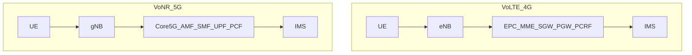
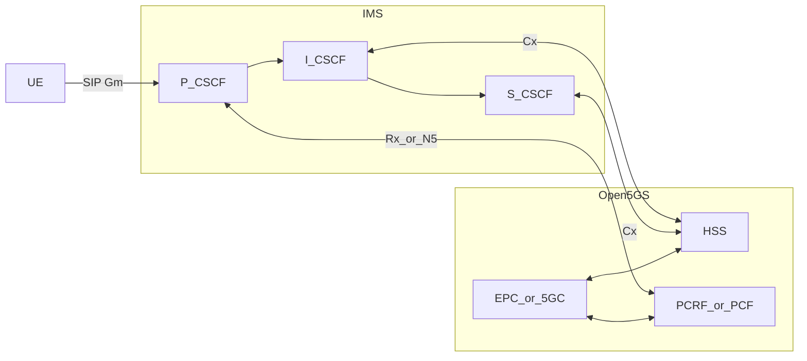
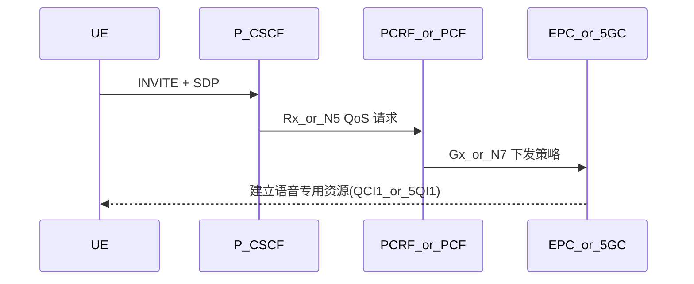
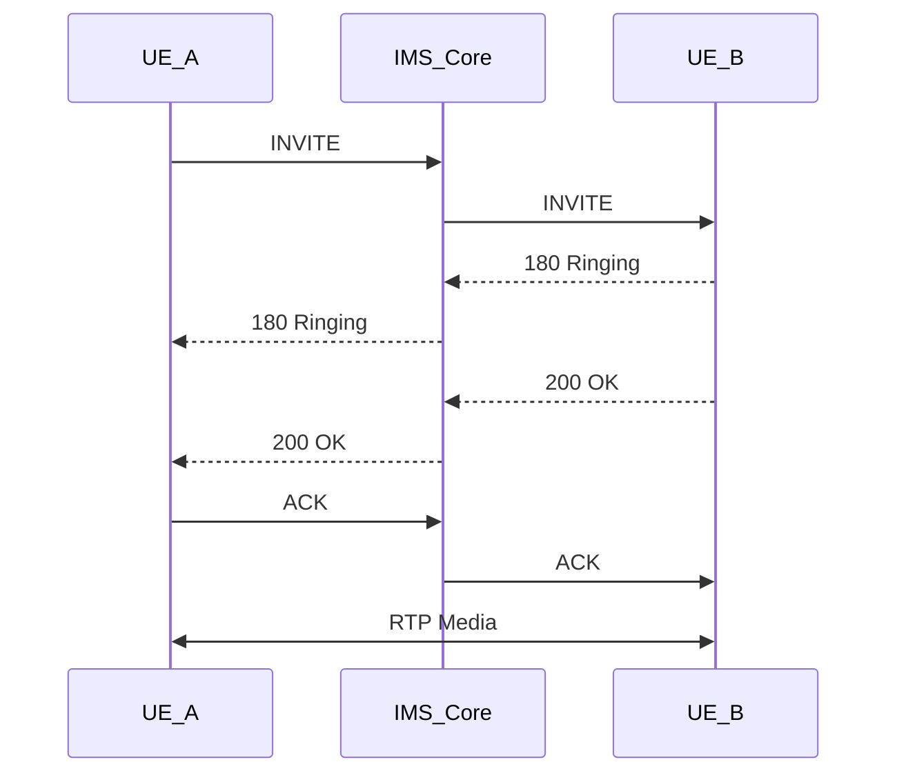
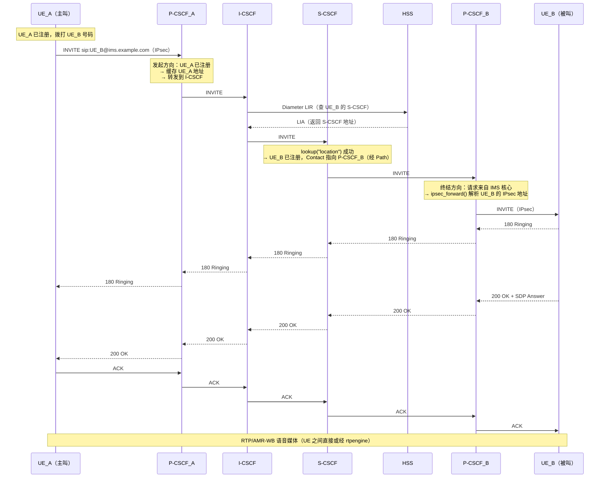

# VoLTE/VoNR 与 IMS 集成

本文档从 IMS 视角介绍 VoLTE（4G）和 VoNR（5G）语音系统，重点说明与 Open5GS 的协同方式，以及部署时的关键配置点。

## 什么是 VoLTE / VoNR

- VoLTE：在 LTE/EPC 上通过 IMS 提供语音
- VoNR：在 5G SA/5GC 上通过 IMS 提供语音
- 两者都走分组交换（PS），核心控制面均为 SIP + IMS


## VoLTE 与 VoNR 架构对比



| 功能域 | VoLTE (4G) | VoNR (5G) |
|------|------------|-----------|
| 接入与移动性 | MME | AMF |
| 会话控制 | EPC 会话链路 | SMF |
| 用户面 | SGW/PGW | UPF |
| 策略控制 | PCRF | PCF |
| IMS 接口 | Rx + Cx | N5/Rx + Cx |

## IMS 与 Open5GS 的连接关系

在本项目中，Open5GS 负责接入/核心承载，IMS（常用 Kamailio 承担 CSCF）负责语音业务控制。



## QoS 建立关键路径（语音质量保障）



## Cx（HSS）配置思路

I-CSCF 与 S-CSCF 都需要通过 Cx 接口访问 HSS，以完成：

- 用户归属查询（选择 S-CSCF）
- 鉴权向量获取（AKA）
- 注册状态更新（用户绑定）

可采用两种模式：

1. 独立 IMS HSS（如 FHoSS）
2. 复用 Open5GS HSS（本项目侧重该模式）

## APN / DNN 设计

VoLTE/VoNR 建议至少区分两个数据通道：

- `internet`：普通数据业务
- `ims`：IMS 信令和语音相关业务

```yaml
session:
  - subnet: 10.45.0.1/16
    dnn: internet
  - subnet: 10.46.0.1/16
    dnn: ims
```

## DNS 在 IMS 中的作用

IMS 强依赖 DNS 进行网元发现，典型域名：

- `ims.mncXXX.mccXXX.3gppnetwork.org`
- `epc.mncXXX.mccXXX.3gppnetwork.org`

至少需要保证：

- P-CSCF/I-CSCF/S-CSCF 的 A/AAAA 记录
- SIP SRV 记录（用于服务发现）
- UE 能通过 PCO 拿到可用 DNS

## 通话建立（简化）



## IMS 域内通话完整流程

上图将 IMS 简化为一个黑盒。下面展开 CSCF 链路，展示两个 VoLTE UE 在同一 IMS 域内通话时，INVITE 如何在各网元之间路由：



### 路由关键点

上面的流程中有几个值得注意的细节：

**主叫侧 P-CSCF 与被叫侧 P-CSCF 可以相同也可以不同。** 在实验环境中通常只有一个 P-CSCF 实例（`PA` 和 `PB` 是同一进程），但在运营商网络中，主叫和被叫可能接入不同地区的 P-CSCF。

**I-CSCF 在域内通话中仍然参与。** 即使主叫和被叫在同一 S-CSCF 上，P-CSCF 也不会直接发到 S-CSCF——它总是先经过 I-CSCF，由 I-CSCF 查 HSS 决定路由。这保证了架构的一致性和 S-CSCF 分配的灵活性（参见 [为什么 I-CSCF 和 S-CSCF 要分开](/ims/cscf#为什么-i-cscf-和-s-cscf-要分开)）。

**S-CSCF 的 `lookup()` 是决策点。** 如果被叫在 IMS 中注册，S-CSCF 通过 Contact + Path 将 INVITE 路由到被叫的 P-CSCF。如果未注册，则触发 Gateway 回落（见 [Signal6A 桥接机制](/ims/signal6a#_7-桥接-webrtc-↔-ims)）或返回 404。

**媒体路径取决于部署。** 同域 VoLTE 通话中，如果两个 UE 都使用 AMR-WB 且无需转码，RTP 可以直接在 UE 之间流动（或经 P-CSCF 的 rtpengine 锚定以维持 NAT 穿越）。跨域通话才必须经 rtpengine 转码。

## SMS 在 LTE/5G 的位置

VoLTE/VoNR 解决的是语音，SMS 需要单独方案：

- SMSoIP：经 IMS（SIP MESSAGE + IP-SM-GW）
- SMSoNAS：经 NAS（4G/5G 核心侧链路）

实验环境中可先聚焦语音注册与呼叫，SMS 按需补齐。

## 部署建议（实验优先）

- 先打通：UE 入网 -> IMS 注册 -> 语音呼叫
- 再优化：QoS 保证、DNS 完整性、跨域互通
- 最后扩展：SMS、补充业务、AS 触发链路

## 参考资料

- [Open5GS VoLTE Tutorial](https://open5gs.org/open5gs/docs/tutorial/02-VoLTE-setup/)
- [Kamailio IMS Modules](https://www.kamailio.org/docs/modules/)
- [3GPP TS 23.228](https://www.3gpp.org/ftp/Specs/archive/23_series/23.228/)
